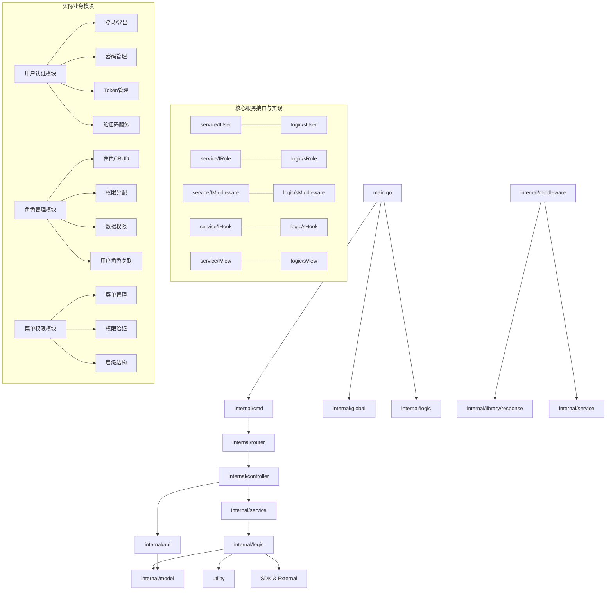

# 模块依赖关系

## 依赖关系图



## 核心接口说明

### 用户服务 (IUser)

- **接口**: `IUser` (internal/service/user.go - 65行)
- **实现**: `sUser` (internal/logic/api/user.go - 441行)
- **职责**: 处理用户认证、登录、密码管理等核心功能

#### 主要接口方法：
```go
type IUser interface {
    // 认证相关
    Login(ctx context.Context, in *sysin.UserLoginInp) (res *sysout.LoginTokenModel, err error)
    Logout(ctx context.Context, in *sysin.UserLogoutInp) error
    RefreshToken(ctx context.Context, refreshToken string) (res *TokenInfo, err error)
    
    // 用户管理
    GetProfile(ctx context.Context, userId int64) (res *sysout.UserModel, err error)
    ChangePassword(ctx context.Context, userId int64, oldPassword, newPassword string) error
    
    // 验证码服务
    GenerateCaptcha(ctx context.Context) (captchaId, captchaImage string, err error)
    VerifyCaptcha(ctx context.Context, captchaId, captcha string) error
    
    // 用户验证
    GetUserByUsername(ctx context.Context, username string) (user *sysout.UserModel, err error)
    ValidateUser(ctx context.Context, username, password string) (user *sysout.UserModel, err error)
}
```

### 角色服务 (IRole)

- **接口**: `IRole` (internal/service/role.go - 62行)
- **实现**: `sRole` (internal/logic/api/role.go - 1086行)
- **职责**: 处理角色管理、权限分配、数据权限控制等功能

#### 主要接口方法：
```go
type IRole interface {
    // 角色基础操作
    GetRoleList(ctx context.Context, in *sysin.RoleListInp) (res *sysout.RoleListModel, err error)
    CreateRole(ctx context.Context, in *sysin.CreateRoleInp) (res *sysout.RoleModel, err error)
    UpdateRole(ctx context.Context, in *sysin.UpdateRoleInp) (res *sysout.RoleModel, err error)
    DeleteRole(ctx context.Context, in *sysin.DeleteRoleInp) (err error)
    BatchDeleteRole(ctx context.Context, in *sysin.BatchDeleteRoleInp) (err error)
    
    // 角色权限管理
    GetRoleMenus(ctx context.Context, in *sysin.RoleMenuInp) (res *sysout.RoleMenuModel, err error)
    UpdateRoleMenus(ctx context.Context, in *sysin.UpdateRoleMenuInp) (err error)
    
    // 用户角色关联
    AssignUserRoles(ctx context.Context, userId int64, roleIds []int64, assignedBy int64) (err error)
    GetUserRoles(ctx context.Context, userId int64) (res []*sysout.RoleModel, err error)
    
    // 权限验证
    CheckUserPermission(ctx context.Context, userId int64, permission string) (bool, error)
    GetUserPermissions(ctx context.Context, userId int64) ([]string, error)
}
```

### 中间件服务 (IMiddleware)

- **接口**: `IMiddleware` (internal/service/middleware.go)
- **实现**: `sMiddleware` (internal/logic/middleware/)
- **职责**: 提供 HTTP 请求处理中间件，包括认证、CORS、日志等

### 钩子服务 (IHook)

- **接口**: `IHook` (internal/service/hook.go)
- **实现**: `sHook` (internal/logic/hook/)
- **职责**: 提供请求生命周期钩子函数

### 视图服务 (IView)

- **接口**: `IView` (internal/service/view.go)
- **实现**: `sView` (internal/logic/)
- **职责**: 处理视图相关逻辑

## 实际数据模型

### 用户实体 (User - 337行)
包含完整的用户信息管理，支持：
- 基本信息（用户名、邮箱、手机等）
- 安全信息（密码、双因子认证等）
- 状态管理（正常、锁定、禁用等）
- 登录追踪（IP、时间、次数等）

### 角色实体 (Role - 180行)
支持完整的角色管理功能：
- 角色基本信息（名称、编码、描述等）
- 数据权限范围控制
- 角色状态和排序管理

### 菜单实体 (Menu - 124行)
支持层级菜单结构：
- 三种类型（目录、菜单、按钮）
- 权限标识管理
- 显示控制和路由配置

## 依赖注入流程

1. 各业务模块在`init()`函数中注册服务实现：

```go
// 用户服务注册
func init() {
    service.RegisterUser(NewUser())
}

// 角色服务注册
func init() {
    service.RegisterRole(NewRole())
}
```

2. 服务获取通过单例模式实现：

```go
func User() IUser {
    if localUser == nil {
        panic("implement not found for interface IUser, forgot register?")
    }
    return localUser
}

func Role() IRole {
    if localRole == nil {
        panic("implement not found for interface IRole, forgot register?")
    }
    return localRole
}
```

3. 控制器通过服务接口调用业务逻辑：

```go
// 用户登录调用
out, err := service.User().Login(ctx, &req.UserLoginInp)

// 角色列表查询调用
out, err := service.Role().GetRoleList(ctx, &req.RoleListInp)
```

## 实际业务流程

### 用户认证流程
```
1. 用户登录请求 → Controller.Login()
2. 调用 service.User().Login()
3. 执行 logic.sUser.Login() (441行实现)
   - 验证用户密码
   - 检查用户状态
   - 获取用户角色
   - 生成JWT Token
   - 更新登录信息
   - 获取用户权限
4. 返回 LoginTokenModel
```

### 权限验证流程
```
1. HTTP请求 → Middleware.ApiAuth()
2. 解析JWT Token
3. 验证用户状态
4. 检查用户权限
5. 设置用户上下文
6. 继续处理请求
```

### 角色权限管理流程
```
1. 角色权限设置 → Controller.UpdateRoleMenus()
2. 调用 service.Role().UpdateRoleMenus()
3. 执行 logic.sRole.UpdateRoleMenus() (1086行实现)
   - 验证角色存在性
   - 更新角色菜单关联
   - 清理权限缓存
4. 返回操作结果
```

## 工具包依赖

### utility包结构
- **captcha/**: 验证码生成和验证
- **charset/**: 字符集处理工具
- **encrypt/**: 加密解密工具
- **simple/**: 通用工具（JWT、响应处理等）
- **validate/**: 数据验证工具

### 外部依赖
- **GoFrame v2.9.0**: 核心框架
- **forgoer/openssl v1.6.0**: 加密工具
- **Jaeger**: 链路追踪

## 模块间通信规则

1. **单向依赖**: 高层模块依赖低层模块，禁止循环依赖
2. **接口隔离**: 模块间通过接口通信，不直接依赖实现
3. **上下文传递**: 所有接口方法使用`context.Context`传递上下文信息
4. **错误处理**: 统一使用GoFrame的gerror进行错误处理
5. **日志记录**: 使用GoFrame内置日志系统进行日志记录

## 依赖管理最佳实践

1. **严格分层**: 避免跨层调用，严格遵循分层架构
2. **接口优先**: 新增功能时先定义接口，再实现业务逻辑
3. **单一职责**: 一个模块只负责一个功能领域
4. **依赖注入**: 通过服务注册机制实现依赖注入，避免硬编码依赖
5. **测试友好**: 通过接口抽象便于单元测试和集成测试

## 实际项目结构映射

```
client-app/
├── internal/
│   ├── service/          # 服务接口层 (5个核心接口)
│   │   ├── user.go       # 用户服务接口 (65行)
│   │   ├── role.go       # 角色服务接口 (62行) 
│   │   ├── middleware.go # 中间件接口
│   │   ├── hook.go       # 钩子接口
│   │   └── view.go       # 视图接口
│   ├── logic/            # 业务逻辑实现层
│   │   ├── api/          # API业务逻辑
│   │   │   ├── user.go   # 用户逻辑实现 (441行)
│   │   │   └── role.go   # 角色逻辑实现 (1086行)
│   │   ├── middleware/   # 中间件实现
│   │   ├── hook/         # 钩子实现
│   │   └── sys/          # 系统级逻辑
│   └── model/entity/     # 核心实体
│       ├── users.go      # 用户实体 (337行)
│       ├── roles.go      # 角色实体 (180行)
│       └── menus.go      # 菜单实体 (124行)
└── utility/              # 工具包支持
```

这种依赖关系设计确保了系统的高内聚低耦合，同时通过完善的接口定义和服务注册机制，实现了良好的可扩展性和可维护性。
