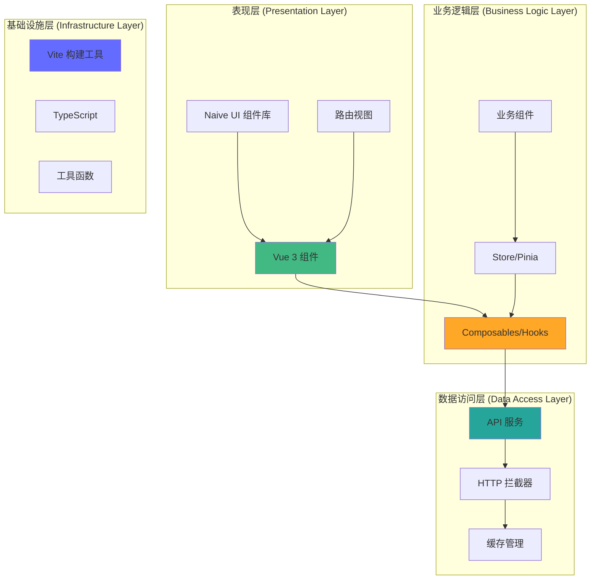
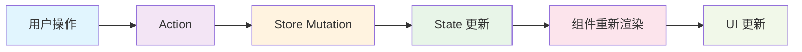
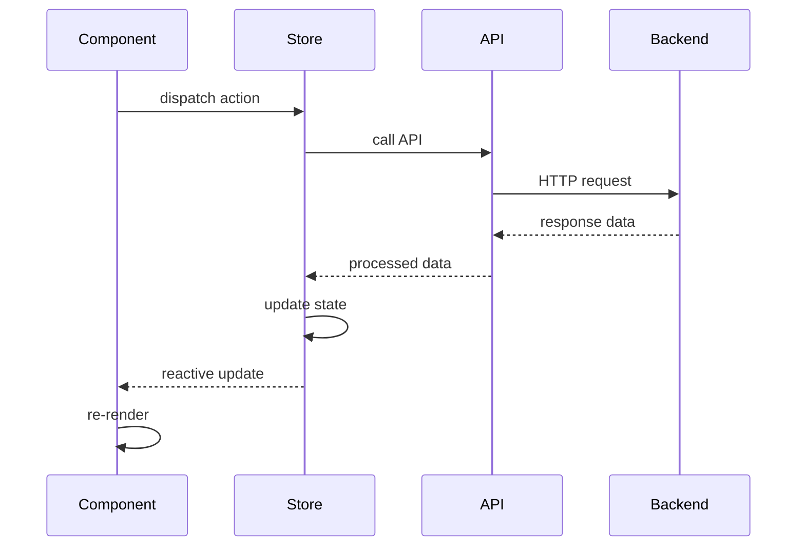

# 核心架构

HotGo 2.0 采用现代化的前端架构设计，基于 Vue 3 生态系统，提供高性能、可维护、可扩展的企业级解决方案。

## 整体架构

### 分层架构图



### 技术架构栈

| 层级 | 技术选型 | 作用 |
|------|----------|------|
| **UI 层** | Vue 3 + Naive UI | 用户界面和交互 |
| **状态管理** | Pinia | 全局状态管理 |
| **路由管理** | Vue Router 4 | 页面路由和导航 |
| **HTTP 通信** | Axios | API 请求和响应处理 |
| **类型系统** | TypeScript | 静态类型检查 |
| **构建工具** | Vite | 开发和构建 |
| **样式系统** | Less + Tailwind CSS | 样式管理 |
| **工具链** | ESLint + Prettier | 代码质量保证 |

## 核心设计原则

### 1. 单一职责原则 (SRP)

每个模块、组件和函数都应该有且仅有一个引起它变化的原因。

```typescript
// ✅ 好的设计：职责单一
class UserService {
  async getUsers() { /* 只负责获取用户数据 */ }
}

class UserValidator {
  validateUser(user: User) { /* 只负责用户数据验证 */ }
}

// ❌ 不好的设计：职责混乱
class UserManager {
  async getUsers() { /* 获取数据 */ }
  validateUser(user: User) { /* 验证数据 */ }
  renderUserList() { /* 渲染界面 */ }
}
```

### 2. 开闭原则 (OCP)

对扩展开放，对修改封闭。通过插件化设计支持功能扩展。

```typescript
// 插件系统设计
interface Plugin {
  name: string;
  install(app: App): void;
}

class PluginManager {
  private plugins: Plugin[] = [];
  
  use(plugin: Plugin) {
    this.plugins.push(plugin);
    return this;
  }
  
  install(app: App) {
    this.plugins.forEach(plugin => plugin.install(app));
  }
}
```

### 3. 依赖倒置原则 (DIP)

高层模块不应该依赖低层模块，两者都应该依赖于抽象。

```typescript
// 抽象接口
interface ApiClient {
  get<T>(url: string): Promise<T>;
  post<T>(url: string, data: any): Promise<T>;
}

// 具体实现
class AxiosApiClient implements ApiClient {
  async get<T>(url: string): Promise<T> {
    return axios.get(url);
  }
  
  async post<T>(url: string, data: any): Promise<T> {
    return axios.post(url, data);
  }
}

// 业务层依赖抽象
class UserService {
  constructor(private apiClient: ApiClient) {}
  
  async getUsers() {
    return this.apiClient.get<User[]>('/users');
  }
}
```

## 模块设计

### 1. 组件模块 (Components)

```
components/
├── Basic/                  # 基础组件
│   ├── Table/             # 表格组件
│   ├── Form/              # 表单组件
│   └── Modal/             # 模态框组件
├── Business/              # 业务组件
│   ├── UserManagement/    # 用户管理
│   └── Dashboard/         # 仪表板
└── Layout/                # 布局组件
    ├── Header/            # 头部
    ├── Sidebar/           # 侧边栏
    └── Footer/            # 底部
```

**组件设计原则**：

- **高内聚低耦合**：组件内部功能紧密相关，组件间依赖最小化
- **可复用性**：通过 props 和 slots 提供灵活的配置选项
- **可测试性**：清晰的输入输出，便于单元测试

```vue
<!-- 组件设计示例 -->
<template>
  <div class="basic-table">
    <div v-if="showToolbar" class="table-toolbar">
      <slot name="toolbar" :selection="selection">
        <default-toolbar />
      </slot>
    </div>
    
    <n-data-table
      v-bind="tableProps"
      @update:checked-row-keys="handleSelectionChange"
    />
    
    <div v-if="showPagination" class="table-pagination">
      <n-pagination v-bind="paginationProps" />
    </div>
  </div>
</template>

<script setup lang="ts">
interface Props {
  columns: TableColumn[];
  dataSource: (params: any) => Promise<any>;
  showToolbar?: boolean;
  showPagination?: boolean;
}

const props = withDefaults(defineProps<Props>(), {
  showToolbar: true,
  showPagination: true,
});

// 组件逻辑封装在 hooks 中
const {
  tableProps,
  paginationProps,
  selection,
  handleSelectionChange,
} = useTable(props);
</script>
```

### 2. Hooks 模块 (Composables)

```
hooks/
├── common/                # 通用 hooks
│   ├── useBoolean.ts     # 布尔值管理
│   ├── useLoading.ts     # 加载状态
│   └── useAsync.ts       # 异步操作
├── business/             # 业务 hooks
│   ├── useUser.ts        # 用户相关
│   └── usePermission.ts  # 权限管理
└── ui/                   # UI 相关 hooks
    ├── useModal.ts       # 模态框
    └── useTable.ts       # 表格
```

**Hooks 设计模式**：

```typescript
// 通用 Hook 模式
export function useAsync<T>(
  asyncFn: () => Promise<T>,
  options: UseAsyncOptions = {}
) {
  const { immediate = false, onSuccess, onError } = options;
  
  const data = ref<T | null>(null);
  const loading = ref(false);
  const error = ref<Error | null>(null);
  
  const execute = async (...args: any[]) => {
    try {
      loading.value = true;
      error.value = null;
      
      const result = await asyncFn(...args);
      data.value = result;
      
      onSuccess?.(result);
      return result;
    } catch (err) {
      error.value = err as Error;
      onError?.(err as Error);
      throw err;
    } finally {
      loading.value = false;
    }
  };
  
  if (immediate) {
    execute();
  }
  
  return {
    data: readonly(data),
    loading: readonly(loading),
    error: readonly(error),
    execute,
  };
}
```

### 3. 状态管理模块 (Store)

```
store/
├── modules/
│   ├── user.ts           # 用户状态
│   ├── permission.ts     # 权限状态
│   ├── app.ts           # 应用状态
│   └── dict.ts          # 字典状态
├── types.ts             # 状态类型定义
└── index.ts             # 状态入口
```

**Store 设计模式**：

```typescript
// 用户状态管理
export const useUserStore = defineStore('user', () => {
  // 状态
  const userInfo = ref<UserInfo | null>(null);
  const token = ref<string>('');
  const permissions = ref<string[]>([]);
  
  // 计算属性
  const isLoggedIn = computed(() => !!token.value);
  const hasPermission = computed(() => (permission: string) => {
    return permissions.value.includes(permission);
  });
  
  // 方法
  const login = async (credentials: LoginCredentials) => {
    const response = await authApi.login(credentials);
    token.value = response.token;
    userInfo.value = response.user;
    permissions.value = response.permissions;
    
    // 持久化存储
    localStorage.setItem('token', response.token);
  };
  
  const logout = () => {
    token.value = '';
    userInfo.value = null;
    permissions.value = [];
    localStorage.removeItem('token');
  };
  
  const fetchUserInfo = async () => {
    if (!token.value) return;
    
    try {
      const response = await userApi.getUserInfo();
      userInfo.value = response;
    } catch (error) {
      console.error('获取用户信息失败:', error);
      logout();
    }
  };
  
  return {
    // 状态
    userInfo: readonly(userInfo),
    token: readonly(token),
    permissions: readonly(permissions),
    
    // 计算属性
    isLoggedIn,
    hasPermission,
    
    // 方法
    login,
    logout,
    fetchUserInfo,
  };
});
```

### 4. API 模块 (Services)

```
api/
├── types/               # API 类型定义
│   ├── common.ts       # 通用类型
│   └── user.ts         # 用户类型
├── services/           # API 服务
│   ├── user.ts         # 用户 API
│   ├── auth.ts         # 认证 API
│   └── system.ts       # 系统 API
├── interceptors/       # 拦截器
│   ├── request.ts      # 请求拦截器
│   └── response.ts     # 响应拦截器
└── index.ts           # API 入口
```

**API 设计模式**：

```typescript
// API 服务基类
abstract class BaseApiService {
  protected readonly baseURL: string;
  protected readonly http: AxiosInstance;
  
  constructor(baseURL: string) {
    this.baseURL = baseURL;
    this.http = axios.create({ baseURL });
    this.setupInterceptors();
  }
  
  private setupInterceptors() {
    // 请求拦截器
    this.http.interceptors.request.use(
      (config) => {
        const token = localStorage.getItem('token');
        if (token) {
          config.headers.Authorization = `Bearer ${token}`;
        }
        return config;
      },
      (error) => Promise.reject(error)
    );
    
    // 响应拦截器
    this.http.interceptors.response.use(
      (response) => response.data,
      (error) => this.handleError(error)
    );
  }
  
  private handleError(error: AxiosError) {
    if (error.response?.status === 401) {
      // 处理未授权
      this.handleUnauthorized();
    }
    return Promise.reject(error);
  }
  
  protected abstract handleUnauthorized(): void;
}

// 具体 API 服务
class UserApiService extends BaseApiService {
  constructor() {
    super('/api/users');
  }
  
  protected handleUnauthorized() {
    // 跳转到登录页
    router.push('/login');
  }
  
  async getUsers(params: GetUsersParams): Promise<PageResponse<User>> {
    return this.http.get('/list', { params });
  }
  
  async getUserById(id: number): Promise<User> {
    return this.http.get(`/${id}`);
  }
  
  async createUser(user: CreateUserRequest): Promise<User> {
    return this.http.post('/', user);
  }
  
  async updateUser(id: number, user: UpdateUserRequest): Promise<User> {
    return this.http.put(`/${id}`, user);
  }
  
  async deleteUser(id: number): Promise<void> {
    return this.http.delete(`/${id}`);
  }
}

export const userApi = new UserApiService();
```

## 数据流设计

### 单向数据流



### 异步数据流



## 性能优化策略

### 1. 代码分割

```typescript
// 路由级别代码分割
const routes = [
  {
    path: '/user',
    component: () => import('@/views/user/index.vue'),
  },
  {
    path: '/dashboard',
    component: () => import('@/views/dashboard/index.vue'),
  },
];

// 组件级别代码分割
const HeavyComponent = defineAsyncComponent({
  loader: () => import('./HeavyComponent.vue'),
  loadingComponent: LoadingComponent,
  errorComponent: ErrorComponent,
  delay: 200,
  timeout: 3000,
});
```

### 2. 缓存策略

```typescript
// HTTP 缓存
class CacheManager {
  private cache = new Map<string, CacheItem>();
  
  get<T>(key: string): T | null {
    const item = this.cache.get(key);
    if (!item) return null;
    
    if (Date.now() > item.expiry) {
      this.cache.delete(key);
      return null;
    }
    
    return item.data;
  }
  
  set<T>(key: string, data: T, ttl = 5 * 60 * 1000) {
    this.cache.set(key, {
      data,
      expiry: Date.now() + ttl,
    });
  }
}

// 计算属性缓存
const expensiveComputed = computed(() => {
  return heavyCalculation(props.data);
});
```

### 3. 虚拟化

```vue
<!-- 大列表虚拟滚动 -->
<template>
  <VirtualList
    :items="largeDataSet"
    :item-height="itemHeight"
    :visible-count="visibleCount"
    class="virtual-list"
  >
    <template #default="{ item, index }">
      <ListItem :data="item" :index="index" />
    </template>
  </VirtualList>
</template>
```

## 错误处理架构

### 1. 全局错误处理

```typescript
// 全局错误处理器
class ErrorHandler {
  static install(app: App) {
    // Vue 错误处理
    app.config.errorHandler = (error, instance, info) => {
      console.error('Vue Error:', error, info);
      this.reportError(error, { context: 'vue', info });
    };
    
    // 全局未捕获错误
    window.addEventListener('error', (event) => {
      console.error('Global Error:', event.error);
      this.reportError(event.error, { context: 'global' });
    });
    
    // Promise 未捕获错误
    window.addEventListener('unhandledrejection', (event) => {
      console.error('Unhandled Promise Rejection:', event.reason);
      this.reportError(event.reason, { context: 'promise' });
    });
  }
  
  static reportError(error: Error, context: any) {
    // 发送错误报告到监控平台
    if (import.meta.env.PROD) {
      this.sendToMonitoring(error, context);
    }
  }
  
  private static sendToMonitoring(error: Error, context: any) {
    // 实现错误上报逻辑
  }
}
```

### 2. 业务错误处理

```typescript
// 业务错误类型
export class BusinessError extends Error {
  constructor(
    public code: number,
    message: string,
    public data?: any
  ) {
    super(message);
    this.name = 'BusinessError';
  }
}

// 错误处理中间件
export function withErrorHandling<T extends (...args: any[]) => any>(
  fn: T,
  options: ErrorHandlingOptions = {}
): T {
  return ((...args: any[]) => {
    try {
      const result = fn(...args);
      
      if (result instanceof Promise) {
        return result.catch(error => {
          this.handleError(error, options);
          throw error;
        });
      }
      
      return result;
    } catch (error) {
      this.handleError(error, options);
      throw error;
    }
  }) as T;
}
```

## 安全架构

### 1. 权限控制

```typescript
// 权限中间件
export function createPermissionGuard(router: Router) {
  router.beforeEach(async (to, from, next) => {
    const userStore = useUserStore();
    
    // 检查是否需要登录
    if (to.meta.requiresAuth && !userStore.isLoggedIn) {
      next('/login');
      return;
    }
    
    // 检查权限
    if (to.meta.permissions) {
      const hasPermission = to.meta.permissions.some(permission =>
        userStore.hasPermission(permission)
      );
      
      if (!hasPermission) {
        next('/403');
        return;
      }
    }
    
    next();
  });
}
```

### 2. 数据安全

```typescript
// XSS 防护
export function sanitizeHtml(html: string): string {
  const div = document.createElement('div');
  div.textContent = html;
  return div.innerHTML;
}

// CSRF 防护
export function setupCSRFProtection(axios: AxiosInstance) {
  axios.interceptors.request.use(config => {
    const token = getCSRFToken();
    if (token) {
      config.headers['X-CSRF-Token'] = token;
    }
    return config;
  });
}
```

---

下一步：[状态管理](./state-management.md)


