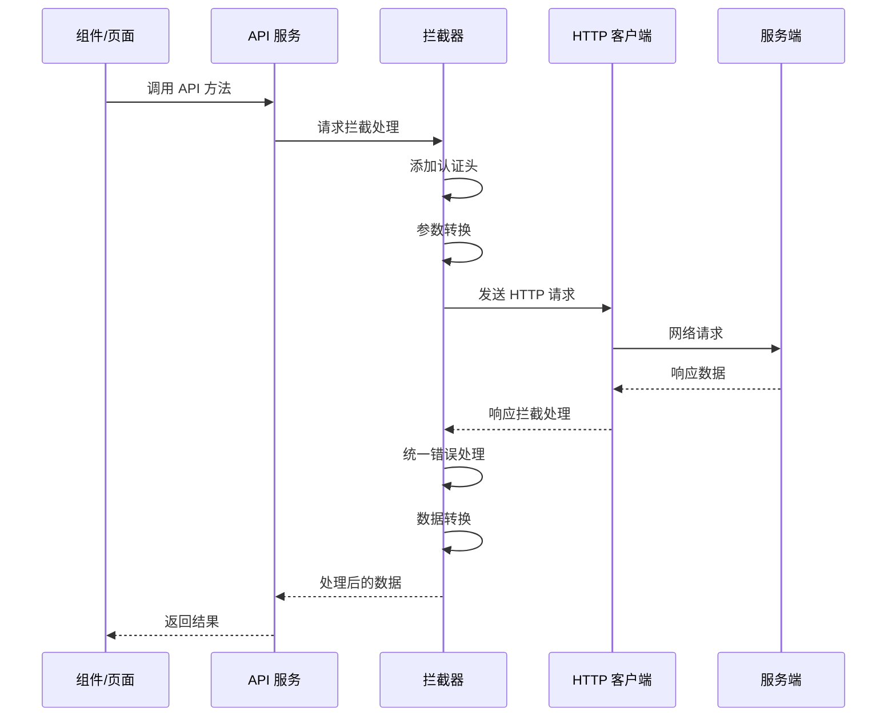
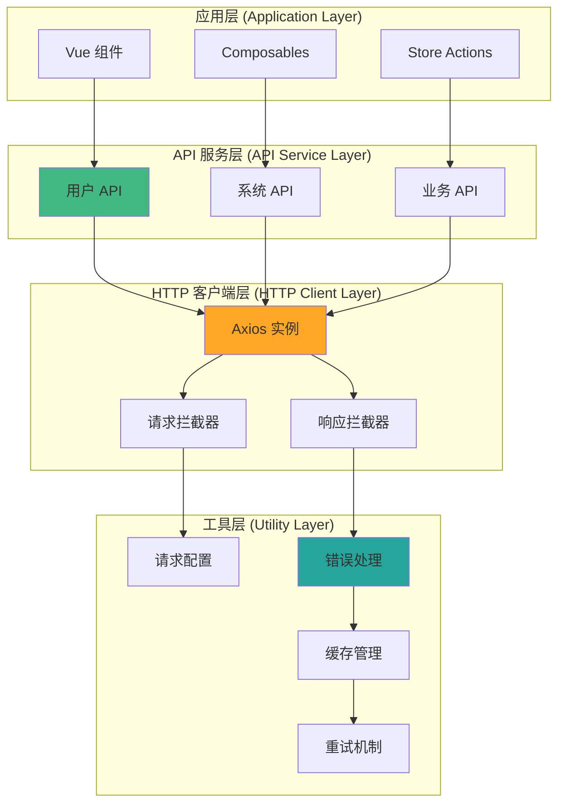

# HTTP 请求架构

HotGo 2.0 基于 Axios 构建了完整的 HTTP 请求架构，提供统一的接口调用、错误处理、缓存管理和性能优化。

## HTTP 架构概览

### 请求处理流程图



### 架构分层设计



## 核心 HTTP 客户端

### 1. Axios 实例配置

```typescript
// utils/http/axios/types.ts
export interface RequestOptions {
  /** 是否自动添加接口前缀 */
  joinPrefix?: boolean;
  /** 是否返回原生响应头 */
  isReturnNativeResponse?: boolean;
  /** 是否转换响应数据 */
  isTransformResponse?: boolean;
  /** 是否显示加载提示 */
  showLoading?: boolean;
  /** 是否显示错误提示 */
  showErrorMessage?: boolean;
  /** 是否忽略重复请求 */
  ignoreCancelToken?: boolean;
  /** 自定义错误处理 */
  errorMessageMode?: 'modal' | 'message' | 'notification' | 'none';
  /** 超时时间 */
  timeout?: number;
  /** 重试次数 */
  retryCount?: number;
  /** 重试延迟 */
  retryDelay?: number;
}

export interface CreateAxiosOptions extends AxiosRequestConfig {
  /** 认证方案 */
  authenticationScheme?: string;
  /** 数据转换器 */
  transform?: AxiosTransform;
  /** 请求选项 */
  requestOptions?: RequestOptions;
}

export interface Result<T = any> {
  code: number;
  message: string;
  data: T;
  timestamp?: number;
  traceId?: string;
}
```

### 2. Axios 实例封装

```typescript
// utils/http/axios/Axios.ts
import type {
  AxiosInstance,
  AxiosRequestConfig,
  AxiosResponse,
  AxiosError,
} from 'axios';
import axios from 'axios';
import { cloneDeep, isFunction } from 'lodash-es';
import type { CreateAxiosOptions, RequestOptions, Result } from './types';
import { AxiosCanceler } from './axiosCancel';

export class VAxios {
  private axiosInstance: AxiosInstance;
  private readonly options: CreateAxiosOptions;

  constructor(options: CreateAxiosOptions) {
    this.options = options;
    this.axiosInstance = axios.create(options);
    this.setupInterceptors();
  }

  /**
   * 创建 Axios 实例
   */
  private createAxios(config: CreateAxiosOptions): void {
    this.axiosInstance = axios.create(config);
  }

  /**
   * 获取数据转换器
   */
  private getTransform() {
    const { transform } = this.options;
    return transform;
  }

  /**
   * 获取 Axios 实例
   */
  getAxios(): AxiosInstance {
    return this.axiosInstance;
  }

  /**
   * 重新配置 Axios
   */
  configAxios(config: CreateAxiosOptions) {
    if (!this.axiosInstance) {
      return;
    }
    this.createAxios(config);
  }

  /**
   * 设置通用头部
   */
  setHeader(headers: Record<string, string>): void {
    if (!this.axiosInstance) {
      return;
    }
    Object.assign(this.axiosInstance.defaults.headers, headers);
  }

  /**
   * 设置拦截器
   */
  private setupInterceptors() {
    const transform = this.getTransform();
    if (!transform) {
      return;
    }

    const {
      requestInterceptors,
      requestInterceptorsCatch,
      responseInterceptors,
      responseInterceptorsCatch,
    } = transform;

    const axiosCanceler = new AxiosCanceler();

    // 请求拦截器配置处理
    this.axiosInstance.interceptors.request.use(
      (config: AxiosRequestConfig) => {
        // 如果启用了取消重复请求，则禁用此次请求
        const { ignoreCancelToken } = config.requestOptions || {};
        const ignoreCancel = ignoreCancelToken ?? this.options.requestOptions?.ignoreCancelToken;

        if (!ignoreCancel) {
          axiosCanceler.addPending(config);
        }

        if (requestInterceptors && isFunction(requestInterceptors)) {
          config = requestInterceptors(config, this.options);
        }
        return config;
      },
      (error: AxiosError) => {
        if (requestInterceptorsCatch && isFunction(requestInterceptorsCatch)) {
          return requestInterceptorsCatch(error);
        }
        return Promise.reject(error);
      }
    );

    // 响应拦截器处理
    this.axiosInstance.interceptors.response.use(
      (res: AxiosResponse<any>) => {
        if (res?.config) {
          axiosCanceler.removePending(res.config);
        }
        if (responseInterceptors && isFunction(responseInterceptors)) {
          res = responseInterceptors(res);
        }
        return res;
      },
      (error: AxiosError) => {
        if (responseInterceptorsCatch && isFunction(responseInterceptorsCatch)) {
          return responseInterceptorsCatch(error);
        }
        return Promise.reject(error);
      }
    );
  }

  /**
   * 文件上传
   */
  uploadFile<T = any>(config: AxiosRequestConfig, params: UploadFileParams) {
    const formData = new FormData();
    const customFilename = params.name || 'file';

    if (params.filename) {
      formData.append(customFilename, params.file, params.filename);
    } else {
      formData.append(customFilename, params.file);
    }

    if (params.data) {
      Object.keys(params.data).forEach((key) => {
        const value = params.data![key];
        if (Array.isArray(value)) {
          value.forEach((item) => {
            formData.append(`${key}[]`, item);
          });
          return;
        }

        formData.append(key, params.data![key]);
      });
    }

    return this.axiosInstance.request<T>({
      ...config,
      method: 'POST',
      data: formData,
      headers: {
        'Content-type': ContentTypeEnum.FORM_DATA,
        // eslint-disable-next-line @typescript-eslint/no-explicit-any
        ignoreCancelToken: true,
      } as any,
    });
  }

  /**
   * 支持表单数据
   */
  supportFormData(config: AxiosRequestConfig) {
    const headers = config.headers || this.options.headers;
    const contentType = headers?.['Content-Type'] || headers?.['content-type'];

    if (
      contentType !== ContentTypeEnum.FORM_URLENCODED ||
      !Reflect.has(config, 'data') ||
      config.method?.toUpperCase() === RequestEnum.GET
    ) {
      return config;
    }

    return {
      ...config,
      data: qs.stringify(config.data, { arrayFormat: 'brackets' }),
    };
  }

  /**
   * 通用请求方法
   */
  request<T = any>(config: AxiosRequestConfig, options?: RequestOptions): Promise<T> {
    let conf: CreateAxiosOptions = cloneDeep(config);
    const transform = this.getTransform();

    const { requestOptions } = this.options;

    const opt: RequestOptions = Object.assign({}, requestOptions, options);

    const { beforeRequestHook, requestCatch, transformRequestHook } = transform || {};

    if (beforeRequestHook && isFunction(beforeRequestHook)) {
      conf = beforeRequestHook(conf, opt);
    }

    conf.requestOptions = opt;

    conf = this.supportFormData(conf);

    return new Promise((resolve, reject) => {
      this.axiosInstance
        .request<any, AxiosResponse<Result>>(conf)
        .then((res: AxiosResponse<Result>) => {
          if (transformRequestHook && isFunction(transformRequestHook)) {
            try {
              const ret = transformRequestHook(res, opt);
              resolve(ret);
            } catch (err) {
              reject(err || new Error('请求错误!'));
            }
            return;
          }
          resolve(res as unknown as Promise<T>);
        })
        .catch((e: Error | AxiosError) => {
          if (requestCatch && isFunction(requestCatch)) {
            reject(requestCatch(e, opt));
            return;
          }
          if (axios.isAxiosError(e)) {
            // 重写错误消息从 axios 中获取
          }
          reject(e);
        });
    });
  }

  /**
   * GET 请求
   */
  get<T = any>(config: AxiosRequestConfig, options?: RequestOptions): Promise<T> {
    return this.request({ ...config, method: 'GET' }, options);
  }

  /**
   * POST 请求
   */
  post<T = any>(config: AxiosRequestConfig, options?: RequestOptions): Promise<T> {
    return this.request({ ...config, method: 'POST' }, options);
  }

  /**
   * PUT 请求
   */
  put<T = any>(config: AxiosRequestConfig, options?: RequestOptions): Promise<T> {
    return this.request({ ...config, method: 'PUT' }, options);
  }

  /**
   * DELETE 请求
   */
  delete<T = any>(config: AxiosRequestConfig, options?: RequestOptions): Promise<T> {
    return this.request({ ...config, method: 'DELETE' }, options);
  }
}
```

### 3. 请求取消管理

```typescript
// utils/http/axios/axiosCancel.ts
import type { AxiosRequestConfig, Canceler } from 'axios';
import axios from 'axios';
import { isFunction } from 'lodash-es';

// 用于存储每个请求的标识和取消函数
let pendingMap = new Map<string, Canceler>();

export const getPendingUrl = (config: AxiosRequestConfig) => [config.method, config.url].join('&');

export class AxiosCanceler {
  /**
   * 添加请求
   */
  addPending(config: AxiosRequestConfig) {
    this.removePending(config);
    const url = getPendingUrl(config);
    config.cancelToken =
      config.cancelToken ||
      new axios.CancelToken((cancel) => {
        if (!pendingMap.has(url)) {
          // 如果 pending 中不存在当前请求，则添加进去
          pendingMap.set(url, cancel);
        }
      });
  }

  /**
   * 移除请求
   */
  removePending(config: AxiosRequestConfig) {
    const url = getPendingUrl(config);

    if (pendingMap.has(url)) {
      // 如果在 pending 中存在当前请求标识，需要取消当前请求，并且移除
      const cancel = pendingMap.get(url);
      cancel && cancel();
      pendingMap.delete(url);
    }
  }

  /**
   * 清空所有pending
   */
  removeAllPending() {
    pendingMap.forEach((cancel) => {
      cancel && isFunction(cancel) && cancel();
    });
    pendingMap.clear();
  }

  /**
   * 重置
   */
  reset(): void {
    pendingMap = new Map<string, Canceler>();
  }
}
```

## 数据转换器

### 1. 请求/响应转换

```typescript
// utils/http/axios/axiosTransform.ts
import type { AxiosRequestConfig, AxiosResponse } from 'axios';
import type { RequestOptions, Result } from './types';

export interface AxiosTransform {
  /**
   * 请求之前处理配置
   */
  beforeRequestHook?: (config: AxiosRequestConfig, options: RequestOptions) => AxiosRequestConfig;

  /**
   * 请求成功处理
   */
  transformRequestHook?: (res: AxiosResponse<Result>, options: RequestOptions) => any;

  /**
   * 请求失败处理
   */
  requestCatch?: (e: Error, options: RequestOptions) => Promise<any>;

  /**
   * 请求之前的拦截器
   */
  requestInterceptors?: (config: AxiosRequestConfig, options: CreateAxiosOptions) => AxiosRequestConfig;

  /**
   * 请求之后的拦截器
   */
  responseInterceptors?: (res: AxiosResponse<any>) => AxiosResponse<any>;

  /**
   * 请求之前的拦截器错误处理
   */
  requestInterceptorsCatch?: (error: Error) => void;

  /**
   * 请求之后的拦截器错误处理
   */
  responseInterceptorsCatch?: (error: Error) => void;
}

/**
 * 数据处理，方便区分多种处理方式
 */
export const transform: AxiosTransform = {
  /**
   * 处理请求数据。如果数据不是预期格式，可直接抛出错误
   */
  transformRequestHook: (res: AxiosResponse<Result>, options: RequestOptions) => {
    const { isTransformResponse, isReturnNativeResponse } = options;

    // 是否返回原生响应头 比如：需要获取响应头时使用该属性
    if (isReturnNativeResponse) {
      return res;
    }

    // 不进行任何处理，直接返回
    // 用于页面代码可能需要直接获取 code，data，message 这些信息时开启
    if (!isTransformResponse) {
      return res.data;
    }

    const { data } = res;
    if (!data) {
      throw new Error('请求出错，请稍候重试');
    }

    // 这里 code，result，message为 后台统一的字段，需要在 types.ts 内修改为项目自己的接口返回格式
    const { code, data: result, message } = data;

    // 这里逻辑可以根据项目进行修改
    const hasSuccess = data && Reflect.has(data, 'code') && code === 0;

    if (hasSuccess) {
      let successMsg = message;

      if (isNull(successMsg) || isUnDef(successMsg) || isEmpty(successMsg)) {
        successMsg = '操作成功';
      }

      if (options.showSuccessMessage) {
        if (options.successMessageMode === 'modal') {
          createSuccessModal({ title: '操作成功', content: successMsg });
        } else if (options.successMessageMode === 'message') {
          window.$message?.success(successMsg);
        }
      }

      return result;
    }

    // 在此处根据自己项目的实际情况对不同的 code 执行不同的操作
    // 如果不希望中断当前请求，请 return 数据，否则直接抛出异常即可
    let timeoutMsg = '';
    switch (code) {
      case ResultEnum.TIMEOUT:
        timeoutMsg = '登录超时，请重新登录!';
        const userStore = useUserStoreWithOut();
        userStore.setToken(undefined);
        userStore.logout(true);
        break;
      default:
        if (message) {
          timeoutMsg = message;
        }
    }

    // errorMessageMode='modal' 的时候会显示 modal 错误弹窗，而不是消息提示，用于一些比较重要的错误
    // errorMessageMode='none' 一般是调用时明确表示不希望自动弹出错误信息提示
    if (options.errorMessageMode === 'modal') {
      createErrorModal({ title: '错误提示', content: timeoutMsg });
    } else if (options.errorMessageMode === 'message') {
      window.$message?.error(timeoutMsg);
    }

    throw new Error(timeoutMsg || '请求出错，请稍候重试');
  },

  // 请求之前处理 config
  beforeRequestHook: (config, options) => {
    const { apiUrl, joinPrefix, joinParamsToUrl, formatDate, joinTime = true, urlPrefix } = options;

    if (joinPrefix) {
      config.url = `${urlPrefix}${config.url}`;
    }

    if (apiUrl && isString(apiUrl)) {
      config.url = `${apiUrl}${config.url}`;
    }

    const params = config.params || {};
    const data = config.data || false;

    if (formatDate && data && !isString(data)) {
      formatRequestDate(data);
    }

    if (config.method?.toUpperCase() === RequestEnum.GET) {
      if (!isString(params)) {
        // 给 get 请求加上时间戳参数，避免从缓存中拿数据。
        config.params = Object.assign(params || {}, joinTimestamp(joinTime, false));
      } else {
        // 兼容 restful 风格
        config.url = config.url + params + `${joinTimestamp(joinTime, true)}`;
        config.params = undefined;
      }
    } else {
      if (!isString(params)) {
        formatRequestDate(params);
        if (Reflect.has(config, 'data') && config.data && Object.keys(config.data).length > 0) {
          config.data = data;
          config.params = params;
        } else {
          // 非GET请求如果没有提供data，则将params视为data
          config.data = params;
          config.params = undefined;
        }
        if (joinParamsToUrl) {
          config.url = setObjToUrlParams(
            config.url as string,
            Object.assign({}, config.params, config.data)
          );
        }
      } else {
        // 兼容 restful 风格
        config.url = config.url + params;
        config.params = undefined;
      }
    }
    return config;
  },

  /**
   * 请求拦截器处理
   */
  requestInterceptors: (config, options) => {
    // 请求之前处理config
    const userStore = useUserStoreWithOut();
    const token = userStore.getToken;
    if (token && (config as Recordable)?.requestOptions?.withToken !== false) {
      // jwt token
      (config as Recordable).headers.Authorization = options.authenticationScheme
        ? `${options.authenticationScheme} ${token}`
        : token;
    }
    return config;
  },

  /**
   * 响应拦截器处理
   */
  responseInterceptors: (res: AxiosResponse<any>) => {
    return res;
  },

  /**
   * 响应错误处理
   */
  responseInterceptorsCatch: (error: any) => {
    const { response, code, message, config } = error || {};
    const errorMessageMode = config?.requestOptions?.errorMessageMode || 'message';
    const msg: string = response?.data?.error?.message ?? '';
    const err: string = error?.toString?.() ?? '';
    let errMessage = '';

    try {
      if (code === 'ECONNABORTED' && message.indexOf('timeout') !== -1) {
        errMessage = '接口请求超时，请刷新页面重试!';
      }
      if (err?.includes('Network Error')) {
        errMessage = '网络异常，请检查您的网络连接是否正常!';
      }

      if (errMessage) {
        if (errorMessageMode === 'modal') {
          createErrorModal({ title: '错误提示', content: errMessage });
        } else if (errorMessageMode === 'message') {
          window.$message?.error(errMessage);
        }
        return Promise.reject(error);
      }
    } catch (error) {
      throw new Error(error as unknown as string);
    }

    checkStatus(error?.response?.status, msg, errorMessageMode);
    return Promise.reject(error);
  },
};
```

## API 服务层

### 1. 基础 API 服务类

```typescript
// api/base/BaseApiService.ts
import type { AxiosRequestConfig } from 'axios';
import { http } from '@/utils/http';

export abstract class BaseApiService {
  protected baseURL: string;

  constructor(baseURL: string) {
    this.baseURL = baseURL;
  }

  /**
   * GET 请求
   */
  protected get<T = any>(url: string, config?: AxiosRequestConfig): Promise<T> {
    return http.get({ url: `${this.baseURL}${url}`, ...config });
  }

  /**
   * POST 请求
   */
  protected post<T = any>(url: string, data?: any, config?: AxiosRequestConfig): Promise<T> {
    return http.post({ url: `${this.baseURL}${url}`, data, ...config });
  }

  /**
   * PUT 请求
   */
  protected put<T = any>(url: string, data?: any, config?: AxiosRequestConfig): Promise<T> {
    return http.put({ url: `${this.baseURL}${url}`, data, ...config });
  }

  /**
   * DELETE 请求
   */
  protected delete<T = any>(url: string, config?: AxiosRequestConfig): Promise<T> {
    return http.delete({ url: `${this.baseURL}${url}`, ...config });
  }

  /**
   * PATCH 请求
   */
  protected patch<T = any>(url: string, data?: any, config?: AxiosRequestConfig): Promise<T> {
    return http.request({ url: `${this.baseURL}${url}`, method: 'PATCH', data, ...config });
  }

  /**
   * 文件上传
   */
  protected upload<T = any>(url: string, formData: FormData, config?: AxiosRequestConfig): Promise<T> {
    return http.post({
      url: `${this.baseURL}${url}`,
      data: formData,
      headers: {
        'Content-Type': 'multipart/form-data',
      },
      ...config,
    });
  }

  /**
   * 文件下载
   */
  protected download(url: string, params?: any, filename?: string): Promise<void> {
    return http.get(
      {
        url: `${this.baseURL}${url}`,
        params,
        responseType: 'blob',
      },
      {
        isTransformResponse: false,
      }
    ).then((response) => {
      const blob = new Blob([response.data]);
      const downloadUrl = window.URL.createObjectURL(blob);
      const link = document.createElement('a');
      link.href = downloadUrl;
      link.download = filename || 'download';
      document.body.appendChild(link);
      link.click();
      document.body.removeChild(link);
      window.URL.revokeObjectURL(downloadUrl);
    });
  }
}
```

### 2. 具体 API 服务实现

```typescript
// api/system/user.ts
import { BaseApiService } from '../base/BaseApiService';
import type {
  UserInfo,
  CreateUserRequest,
  UpdateUserRequest,
  UserListParams,
  PageResponse,
} from '@/types/api';

class UserApiService extends BaseApiService {
  constructor() {
    super('/system/user');
  }

  /**
   * 获取用户列表
   */
  async getUsers(params: UserListParams): Promise<PageResponse<UserInfo>> {
    return this.get('/list', { params });
  }

  /**
   * 获取用户详情
   */
  async getUserById(id: number): Promise<UserInfo> {
    return this.get(`/${id}`);
  }

  /**
   * 创建用户
   */
  async createUser(user: CreateUserRequest): Promise<UserInfo> {
    return this.post('/', user);
  }

  /**
   * 更新用户
   */
  async updateUser(id: number, user: UpdateUserRequest): Promise<UserInfo> {
    return this.put(`/${id}`, user);
  }

  /**
   * 删除用户
   */
  async deleteUser(id: number): Promise<void> {
    return this.delete(`/${id}`);
  }

  /**
   * 批量删除用户
   */
  async batchDeleteUsers(ids: number[]): Promise<void> {
    return this.post('/batch-delete', { ids });
  }

  /**
   * 重置用户密码
   */
  async resetPassword(id: number, newPassword: string): Promise<void> {
    return this.post(`/${id}/reset-password`, { password: newPassword });
  }

  /**
   * 修改用户状态
   */
  async updateUserStatus(id: number, status: number): Promise<void> {
    return this.patch(`/${id}/status`, { status });
  }

  /**
   * 导出用户数据
   */
  async exportUsers(params: UserListParams): Promise<void> {
    return this.download('/export', params, 'users.xlsx');
  }

  /**
   * 导入用户数据
   */
  async importUsers(file: File): Promise<{ successCount: number; failCount: number }> {
    const formData = new FormData();
    formData.append('file', file);
    return this.upload('/import', formData);
  }
}

export const userApi = new UserApiService();
```

## 请求缓存系统

### 1. 缓存管理器

```typescript
// utils/http/cache/CacheManager.ts
interface CacheItem<T = any> {
  data: T;
  timestamp: number;
  expiry: number;
}

export class CacheManager {
  private cache = new Map<string, CacheItem>();
  private maxSize = 100;
  private defaultTTL = 5 * 60 * 1000; // 5分钟

  /**
   * 获取缓存
   */
  get<T = any>(key: string): T | null {
    const item = this.cache.get(key);
    
    if (!item) {
      return null;
    }

    // 检查是否过期
    if (Date.now() > item.expiry) {
      this.cache.delete(key);
      return null;
    }

    return item.data;
  }

  /**
   * 设置缓存
   */
  set<T = any>(key: string, data: T, ttl: number = this.defaultTTL): void {
    // 如果缓存已满，删除最旧的条目
    if (this.cache.size >= this.maxSize) {
      const firstKey = this.cache.keys().next().value;
      this.cache.delete(firstKey);
    }

    this.cache.set(key, {
      data,
      timestamp: Date.now(),
      expiry: Date.now() + ttl,
    });
  }

  /**
   * 删除缓存
   */
  delete(key: string): boolean {
    return this.cache.delete(key);
  }

  /**
   * 清空缓存
   */
  clear(): void {
    this.cache.clear();
  }

  /**
   * 批量删除缓存
   */
  deleteByPattern(pattern: string): void {
    const regex = new RegExp(pattern);
    
    for (const key of this.cache.keys()) {
      if (regex.test(key)) {
        this.cache.delete(key);
      }
    }
  }

  /**
   * 获取缓存大小
   */
  size(): number {
    return this.cache.size;
  }

  /**
   * 获取缓存键列表
   */
  keys(): string[] {
    return Array.from(this.cache.keys());
  }
}

export const cacheManager = new CacheManager();
```

### 2. 缓存装饰器

```typescript
// utils/http/cache/cacheDecorator.ts
import { cacheManager } from './CacheManager';

export interface CacheOptions {
  ttl?: number;
  key?: string | ((args: any[]) => string);
  enabled?: boolean;
}

/**
 * 缓存装饰器
 */
export function Cache(options: CacheOptions = {}) {
  return function (target: any, propertyName: string, descriptor: PropertyDescriptor) {
    const method = descriptor.value;
    const { ttl = 5 * 60 * 1000, enabled = true } = options;

    descriptor.value = async function (...args: any[]) {
      if (!enabled) {
        return method.apply(this, args);
      }

      // 生成缓存键
      let cacheKey: string;
      if (typeof options.key === 'function') {
        cacheKey = options.key(args);
      } else if (typeof options.key === 'string') {
        cacheKey = options.key;
      } else {
        cacheKey = `${target.constructor.name}.${propertyName}:${JSON.stringify(args)}`;
      }

      // 检查缓存
      const cached = cacheManager.get(cacheKey);
      if (cached) {
        return cached;
      }

      // 执行原方法
      const result = await method.apply(this, args);

      // 设置缓存
      cacheManager.set(cacheKey, result, ttl);

      return result;
    };
  };
}

// 使用示例
class UserApiService extends BaseApiService {
  @Cache({ ttl: 10 * 60 * 1000 }) // 缓存10分钟
  async getUserById(id: number): Promise<UserInfo> {
    return this.get(`/${id}`);
  }

  @Cache({
    key: (args) => `user-list:${JSON.stringify(args[0])}`,
    ttl: 5 * 60 * 1000,
  })
  async getUsers(params: UserListParams): Promise<PageResponse<UserInfo>> {
    return this.get('/list', { params });
  }
}
```

## 错误处理系统

### 1. HTTP 状态码处理

```typescript
// utils/http/checkStatus.ts
import type { ErrorMessageMode } from '@/types/axios';

export function checkStatus(
  status: number,
  msg: string,
  errorMessageMode: ErrorMessageMode = 'message'
): void {
  let errMessage = '';

  switch (status) {
    case 400:
      errMessage = `${msg}`;
      break;
    case 401:
      errMessage = '用户没有权限（令牌、用户名、密码错误）!';
      break;
    case 403:
      errMessage = '用户得到授权，但是访问是被禁止的。!';
      break;
    case 404:
      errMessage = `网络请求错误，未找到该资源!`;
      break;
    case 405:
      errMessage = `网络请求错误，请求方法未允许!`;
      break;
    case 408:
      errMessage = `网络请求超时!`;
      break;
    case 500:
      errMessage = `服务器错误，请联系管理员!`;
      break;
    case 501:
      errMessage = `网络未实现!`;
      break;
    case 502:
      errMessage = `网络错误!`;
      break;
    case 503:
      errMessage = `服务不可用，服务器暂时过载或维护!`;
      break;
    case 504:
      errMessage = `网络超时!`;
      break;
    case 505:
      errMessage = `http版本不支持该请求!`;
      break;
    default:
  }

  if (errMessage) {
    if (errorMessageMode === 'modal') {
      createErrorModal({ title: '错误提示', content: errMessage });
    } else if (errorMessageMode === 'message') {
      window.$message?.error(errMessage);
    }
  }
}
```

### 2. 业务错误处理

```typescript
// utils/http/errorHandler.ts
export class ApiError extends Error {
  public code: number;
  public data?: any;

  constructor(code: number, message: string, data?: any) {
    super(message);
    this.code = code;
    this.data = data;
    this.name = 'ApiError';
  }
}

export class NetworkError extends Error {
  public status?: number;

  constructor(message: string, status?: number) {
    super(message);
    this.status = status;
    this.name = 'NetworkError';
  }
}

/**
 * 统一错误处理
 */
export function handleApiError(error: any): never {
  if (error.response) {
    const { status, data } = error.response;
    throw new ApiError(status, data.message || '请求失败', data);
  } else if (error.request) {
    throw new NetworkError('网络连接失败，请检查网络设置');
  } else {
    throw new Error(error.message || '未知错误');
  }
}
```

## 性能优化

### 1. 请求重试

```typescript
// utils/http/retry.ts
export interface RetryOptions {
  retries: number;
  retryDelay: number;
  retryCondition?: (error: any) => boolean;
}

export async function withRetry<T>(
  fn: () => Promise<T>,
  options: RetryOptions
): Promise<T> {
  const { retries, retryDelay, retryCondition = () => true } = options;
  
  let lastError: any;
  
  for (let i = 0; i <= retries; i++) {
    try {
      return await fn();
    } catch (error) {
      lastError = error;
      
      if (i === retries || !retryCondition(error)) {
        break;
      }
      
      await new Promise(resolve => setTimeout(resolve, retryDelay * (i + 1)));
    }
  }
  
  throw lastError;
}
```

### 2. 请求去重

```typescript
// utils/http/deduplication.ts
const pendingRequests = new Map<string, Promise<any>>();

export function deduplicateRequest<T>(
  key: string,
  requestFn: () => Promise<T>
): Promise<T> {
  if (pendingRequests.has(key)) {
    return pendingRequests.get(key)!;
  }

  const promise = requestFn().finally(() => {
    pendingRequests.delete(key);
  });

  pendingRequests.set(key, promise);
  return promise;
}
```

---

这样我们就完成了完整的架构设计文档。接下来需要更新侧边栏导航来包含这些新增的架构文档。


