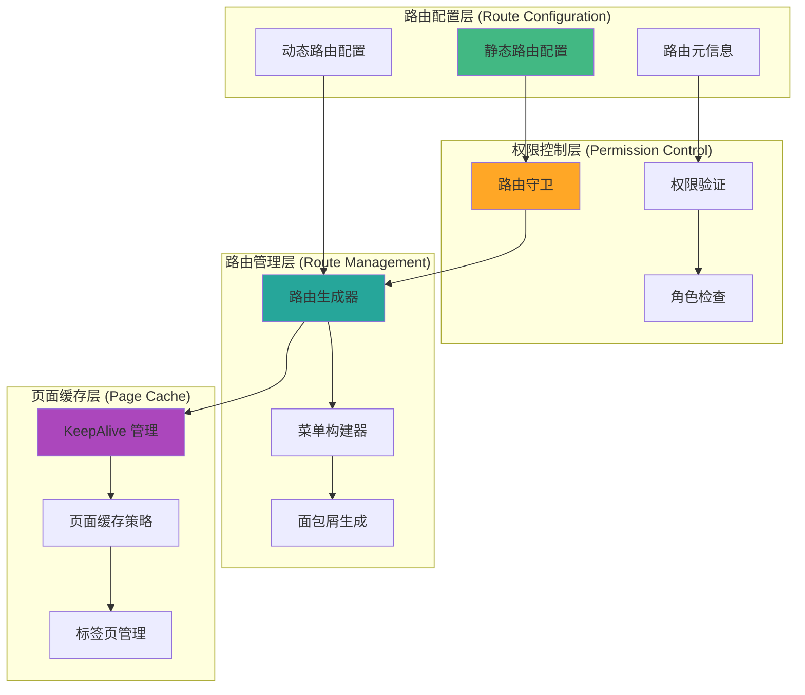

# 路由系统

HotGo 2.0 基于 Vue Router 4 构建了强大的路由系统，支持动态路由生成、权限控制、页面缓存等企业级功能。

## 路由架构概览

### 路由系统架构图



## 路由配置结构

### 1. 基础路由配置

```typescript
// router/constant.ts - 路由常量定义
export const PageEnum = {
  // 基础页面
  BASE_LOGIN: '/login',
  BASE_HOME: '/dashboard',
  ERROR_403: '/exception/403',
  ERROR_404: '/exception/404',
  ERROR_500: '/exception/500',
} as const;

export const REDIRECT_NAME = 'Redirect';

// 不需要权限的页面
export const WHITE_NAME_LIST = [
  'Login',
  'Register',
  'NotFound',
  'Exception403',
  'Exception500',
] as const;
```

### 2. 路由元信息类型

```typescript
// types/router.d.ts
declare module 'vue-router' {
  interface RouteMeta {
    /** 页面标题 */
    title?: string;
    
    /** 菜单图标 */
    icon?: string;
    
    /** 是否需要登录 */
    requiresAuth?: boolean;
    
    /** 需要的权限列表 */
    permissions?: string[];
    
    /** 需要的角色列表 */
    roles?: string[];
    
    /** 是否在菜单中隐藏 */
    hideInMenu?: boolean;
    
    /** 是否在标签页中隐藏 */
    hideInTabs?: boolean;
    
    /** 是否固定在标签页 */
    affix?: boolean;
    
    /** 是否缓存页面 */
    keepAlive?: boolean;
    
    /** 菜单排序 */
    sort?: number;
    
    /** 激活的菜单路径 */
    activeMenu?: string;
    
    /** 外部链接 */
    href?: string;
    
    /** 是否为单页面应用的一部分 */
    isSingle?: boolean;
    
    /** 过渡动画名称 */
    transition?: string;
    
    /** 是否全屏显示 */
    fullscreen?: boolean;
  }
}

export interface RouteModule {
  path: string;
  name: string;
  component?: any;
  redirect?: string;
  meta?: RouteMeta;
  children?: RouteModule[];
}
```

### 3. 静态路由配置

```typescript
// router/base.ts - 基础路由
import type { RouteRecordRaw } from 'vue-router';
import { PageEnum } from './constant';

// 根路由
export const RootRoute: RouteRecordRaw = {
  path: '/',
  name: 'Root',
  redirect: PageEnum.BASE_HOME,
  meta: {
    title: 'Root',
  },
};

// 登录路由
export const LoginRoute: RouteRecordRaw = {
  path: PageEnum.BASE_LOGIN,
  name: 'Login',
  component: () => import('@/views/login/index.vue'),
  meta: {
    title: '登录',
  },
};

// 重定向路由
export const RedirectRoute: RouteRecordRaw = {
  path: '/redirect',
  name: REDIRECT_NAME,
  component: () => import('@/layout/index.vue'),
  meta: {
    title: REDIRECT_NAME,
    hideInMenu: true,
    hideInTabs: true,
  },
  children: [
    {
      path: '/redirect/:path(.*)',
      name: REDIRECT_NAME,
      component: () => import('@/views/redirect/index.vue'),
      meta: {
        title: REDIRECT_NAME,
        hideInMenu: true,
        hideInTabs: true,
      },
    },
  ],
};

// 异常页面路由
export const ExceptionRoutes: RouteRecordRaw[] = [
  {
    path: '/exception',
    name: 'Exception',
    component: () => import('@/layout/index.vue'),
    redirect: '/exception/404',
    meta: {
      title: '异常页面',
      hideInMenu: true,
    },
    children: [
      {
        path: '403',
        name: 'Exception403',
        component: () => import('@/views/exception/403.vue'),
        meta: {
          title: '403',
          hideInMenu: true,
        },
      },
      {
        path: '404',
        name: 'Exception404',
        component: () => import('@/views/exception/404.vue'),
        meta: {
          title: '404',
          hideInMenu: true,
        },
      },
      {
        path: '500',
        name: 'Exception500',
        component: () => import('@/views/exception/500.vue'),
        meta: {
          title: '500',
          hideInMenu: true,
        },
      },
    ],
  },
];

// 404路由（必须放在最后）
export const NotFoundRoute: RouteRecordRaw = {
  path: '/:pathMatch(.*)*',
  name: 'NotFound',
  component: () => import('@/views/exception/404.vue'),
  meta: {
    title: '页面不存在',
    hideInMenu: true,
    hideInTabs: true,
  },
};

// 基础路由列表
export const basicRoutes: RouteRecordRaw[] = [
  RootRoute,
  LoginRoute,
  RedirectRoute,
  ...ExceptionRoutes,
];
```

## 动态路由生成

### 1. 路由生成器

```typescript
// router/generator.ts - 动态路由生成器
import type { RouteRecordRaw } from 'vue-router';
import type { Menu } from '@/types/menu';

/**
 * 根据菜单生成路由
 */
export function generateRoutes(menus: Menu[]): RouteRecordRaw[] {
  const routes: RouteRecordRaw[] = [];
  
  menus.forEach(menu => {
    const route = generateRoute(menu);
    if (route) {
      routes.push(route);
    }
  });
  
  return routes;
}

/**
 * 生成单个路由
 */
function generateRoute(menu: Menu): RouteRecordRaw | null {
  const {
    id,
    path,
    name,
    component,
    redirect,
    meta,
    children,
  } = menu;
  
  // 基础路由配置
  const route: RouteRecordRaw = {
    path,
    name,
    meta: {
      id,
      title: meta?.title,
      icon: meta?.icon,
      sort: meta?.sort,
      hideInMenu: meta?.hideInMenu,
      hideInTabs: meta?.hideInTabs,
      keepAlive: meta?.keepAlive,
      affix: meta?.affix,
      permissions: meta?.permissions,
      roles: meta?.roles,
      requiresAuth: meta?.requiresAuth ?? true,
    },
  };
  
  // 处理重定向
  if (redirect) {
    route.redirect = redirect;
  }
  
  // 处理组件
  if (component) {
    route.component = loadComponent(component);
  }
  
  // 处理子路由
  if (children && children.length > 0) {
    route.children = children
      .map(child => generateRoute(child))
      .filter(Boolean) as RouteRecordRaw[];
  }
  
  return route;
}

/**
 * 动态加载组件
 */
function loadComponent(component: string) {
  // 处理不同的组件路径格式
  if (component === 'Layout') {
    return () => import('@/layout/index.vue');
  }
  
  if (component === 'ParentLayout') {
    return () => import('@/layout/parentLayout.vue');
  }
  
  // 处理外部链接
  if (component.startsWith('http')) {
    return () => import('@/components/IframeContainer/index.vue');
  }
  
  // 动态导入组件
  return () => import(`@/views/${component}/index.vue`);
}

/**
 * 扁平化路由
 */
export function flattenRoutes(routes: RouteRecordRaw[]): RouteRecordRaw[] {
  const flattened: RouteRecordRaw[] = [];
  
  function flatten(routes: RouteRecordRaw[], parentPath = '') {
    routes.forEach(route => {
      const fullPath = parentPath + route.path;
      
      flattened.push({
        ...route,
        path: fullPath,
      });
      
      if (route.children) {
        flatten(route.children, fullPath);
      }
    });
  }
  
  flatten(routes);
  return flattened;
}

/**
 * 过滤有权限的路由
 */
export function filterRoutesByPermission(
  routes: RouteRecordRaw[],
  permissions: string[]
): RouteRecordRaw[] {
  return routes.filter(route => {
    if (route.meta?.permissions) {
      return route.meta.permissions.some(permission =>
        permissions.includes(permission)
      );
    }
    
    if (route.children) {
      route.children = filterRoutesByPermission(route.children, permissions);
      return route.children.length > 0;
    }
    
    return true;
  });
}
```

### 2. 菜单构建器

```typescript
// utils/menu.ts - 菜单构建工具
import type { RouteRecordRaw } from 'vue-router';
import type { MenuOption } from 'naive-ui';

export interface MenuItem extends MenuOption {
  id: string;
  path: string;
  name: string;
  title: string;
  icon?: string;
  children?: MenuItem[];
  meta?: Record<string, any>;
}

/**
 * 从路由生成菜单
 */
export function generateMenusFromRoutes(routes: RouteRecordRaw[]): MenuItem[] {
  const menus: MenuItem[] = [];
  
  routes.forEach(route => {
    if (route.meta?.hideInMenu) return;
    
    const menu = generateMenuItem(route);
    if (menu) {
      menus.push(menu);
    }
  });
  
  return menus.sort((a, b) => (a.meta?.sort || 0) - (b.meta?.sort || 0));
}

/**
 * 生成菜单项
 */
function generateMenuItem(route: RouteRecordRaw): MenuItem | null {
  const {
    path,
    name,
    meta,
    children,
  } = route;
  
  if (!meta?.title) return null;
  
  const menu: MenuItem = {
    id: name as string,
    key: path,
    path,
    name: name as string,
    title: meta.title,
    label: meta.title,
    icon: meta.icon,
    meta,
  };
  
  // 处理子菜单
  if (children && children.length > 0) {
    const childMenus = children
      .map(child => generateMenuItem(child))
      .filter(Boolean) as MenuItem[];
    
    if (childMenus.length > 0) {
      menu.children = childMenus;
    }
  }
  
  return menu;
}

/**
 * 根据权限过滤菜单
 */
export function filterMenusByPermission(
  menus: MenuItem[],
  permissions: string[]
): MenuItem[] {
  return menus.filter(menu => {
    // 检查当前菜单权限
    if (menu.meta?.permissions) {
      const hasPermission = menu.meta.permissions.some((permission: string) =>
        permissions.includes(permission)
      );
      
      if (!hasPermission) return false;
    }
    
    // 递归检查子菜单
    if (menu.children) {
      menu.children = filterMenusByPermission(menu.children, permissions);
      return menu.children.length > 0;
    }
    
    return true;
  });
}

/**
 * 查找菜单项
 */
export function findMenuItem(
  menus: MenuItem[],
  predicate: (menu: MenuItem) => boolean
): MenuItem | null {
  for (const menu of menus) {
    if (predicate(menu)) {
      return menu;
    }
    
    if (menu.children) {
      const found = findMenuItem(menu.children, predicate);
      if (found) return found;
    }
  }
  
  return null;
}

/**
 * 获取菜单路径
 */
export function getMenuPaths(
  menus: MenuItem[],
  targetKey: string,
  currentPath: string[] = []
): string[] {
  for (const menu of menus) {
    const newPath = [...currentPath, menu.key];
    
    if (menu.key === targetKey) {
      return newPath;
    }
    
    if (menu.children) {
      const found = getMenuPaths(menu.children, targetKey, newPath);
      if (found.length > 0) return found;
    }
  }
  
  return [];
}
```

## 路由守卫

### 1. 全局前置守卫

```typescript
// router/guards/beforeEach.ts
import type { Router } from 'vue-router';
import { useUserStore } from '@/store/modules/user';
import { useRouteStore } from '@/store/modules/route';
import { WHITE_NAME_LIST, PageEnum } from '../constant';

/**
 * 创建路由前置守卫
 */
export function createRouterGuards(router: Router) {
  router.beforeEach(async (to, from, next) => {
    // 开始页面加载
    window.$loadingBar?.start();
    
    try {
      const userStore = useUserStore();
      const routeStore = useRouteStore();
      
      // 检查白名单
      if (WHITE_NAME_LIST.includes(to.name as string)) {
        next();
        return;
      }
      
      // 检查登录状态
      if (!userStore.isLoggedIn) {
        // 未登录，重定向到登录页
        if (to.path !== PageEnum.BASE_LOGIN) {
          next({
            path: PageEnum.BASE_LOGIN,
            query: { redirect: to.fullPath },
          });
        } else {
          next();
        }
        return;
      }
      
      // 已登录用户访问登录页，重定向到首页
      if (to.path === PageEnum.BASE_LOGIN) {
        next(PageEnum.BASE_HOME);
        return;
      }
      
      // 检查是否已生成动态路由
      if (!routeStore.isRoutesGenerated) {
        try {
          // 获取用户权限
          await userStore.fetchUserInfo();
          
          // 生成动态路由
          const routes = await routeStore.generateRoutes(userStore.permissions);
          
          // 添加路由到路由器
          routes.forEach(route => {
            router.addRoute(route);
          });
          
          // 重新导航到目标路由
          next({ ...to, replace: true });
          return;
        } catch (error) {
          console.error('生成路由失败:', error);
          await userStore.logout();
          next(PageEnum.BASE_LOGIN);
          return;
        }
      }
      
      // 权限检查
      if (to.meta?.permissions) {
        const hasPermission = to.meta.permissions.some(permission =>
          userStore.hasPermission(permission)
        );
        
        if (!hasPermission) {
          next(PageEnum.ERROR_403);
          return;
        }
      }
      
      // 角色检查
      if (to.meta?.roles) {
        const hasRole = to.meta.roles.some(role =>
          userStore.hasRole(role)
        );
        
        if (!hasRole) {
          next(PageEnum.ERROR_403);
          return;
        }
      }
      
      next();
    } catch (error) {
      console.error('路由守卫错误:', error);
      next(PageEnum.ERROR_500);
    }
  });
}
```

### 2. 全局后置守卫

```typescript
// router/guards/afterEach.ts
import type { Router } from 'vue-router';
import { useAppStore } from '@/store/modules/app';
import { useRouteStore } from '@/store/modules/route';

/**
 * 创建路由后置守卫
 */
export function createAfterEachGuard(router: Router) {
  router.afterEach((to, from) => {
    // 结束页面加载
    window.$loadingBar?.finish();
    
    const appStore = useAppStore();
    const routeStore = useRouteStore();
    
    // 设置页面标题
    if (to.meta?.title) {
      appStore.setPageTitle(to.meta.title);
    }
    
    // 生成面包屑
    const breadcrumbs = generateBreadcrumbs(to);
    appStore.setBreadcrumbs(breadcrumbs);
    
    // 添加标签页
    routeStore.addTab(to);
    
    // 处理页面缓存
    if (to.meta?.keepAlive && to.name) {
      routeStore.addCachedView(to.name as string);
    }
    
    // 移动端自动收起侧边栏
    if (appStore.isMobile && !appStore.sidebarCollapsed) {
      appStore.setSidebarCollapsed(true);
    }
  });
}

/**
 * 生成面包屑
 */
function generateBreadcrumbs(route: RouteLocationNormalized): BreadcrumbItem[] {
  const breadcrumbs: BreadcrumbItem[] = [];
  const matched = route.matched;
  
  matched.forEach((match, index) => {
    if (match.meta?.title && !match.meta.hideInBreadcrumb) {
      breadcrumbs.push({
        title: match.meta.title,
        path: match.path,
        active: index === matched.length - 1,
      });
    }
  });
  
  return breadcrumbs;
}
```

### 3. 路由错误处理

```typescript
// router/guards/errorHandler.ts
import type { Router } from 'vue-router';
import { PageEnum } from '../constant';

/**
 * 创建路由错误处理
 */
export function createErrorHandler(router: Router) {
  router.onError((error) => {
    console.error('路由错误:', error);
    
    // 结束加载状态
    window.$loadingBar?.error();
    
    // 根据错误类型处理
    if (error.message.includes('Failed to resolve component')) {
      // 组件解析失败，可能是组件不存在
      router.push(PageEnum.ERROR_404);
    } else if (error.message.includes('Navigation cancelled')) {
      // 导航被取消，通常是正常的
      return;
    } else {
      // 其他错误
      router.push(PageEnum.ERROR_500);
    }
  });
}
```

## 页面缓存管理

### 1. KeepAlive 组件封装

```vue
<!-- components/KeepAliveWrapper/index.vue -->
<template>
  <router-view v-slot="{ Component, route }">
    <transition
      :name="transitionName"
      mode="out-in"
      appear
    >
      <keep-alive :include="cachedViews" :max="maxCacheCount">
        <component
          :is="Component"
          :key="route.fullPath"
          v-if="route.meta?.keepAlive"
        />
      </keep-alive>
      
      <component
        :is="Component"
        :key="route.fullPath"
        v-if="!route.meta?.keepAlive"
      />
    </transition>
  </router-view>
</template>

<script setup lang="ts">
import { computed } from 'vue';
import { useRouteStore } from '@/store/modules/route';
import { useAppStore } from '@/store/modules/app';

interface Props {
  maxCacheCount?: number;
}

const props = withDefaults(defineProps<Props>(), {
  maxCacheCount: 10,
});

const routeStore = useRouteStore();
const appStore = useAppStore();

const cachedViews = computed(() => routeStore.cachedViews);

const transitionName = computed(() => {
  // 根据设备类型和用户设置确定过渡动画
  if (appStore.isMobile) {
    return 'slide-left';
  }
  return 'fade';
});
</script>

<style scoped>
/* 过渡动画 */
.fade-enter-active,
.fade-leave-active {
  transition: opacity 0.3s ease;
}

.fade-enter-from,
.fade-leave-to {
  opacity: 0;
}

.slide-left-enter-active,
.slide-left-leave-active {
  transition: transform 0.3s ease;
}

.slide-left-enter-from {
  transform: translateX(100%);
}

.slide-left-leave-to {
  transform: translateX(-100%);
}
</style>
```

### 2. 缓存策略管理

```typescript
// composables/usePageCache.ts
import { useRouteStore } from '@/store/modules/route';
import { useRouter, useRoute } from 'vue-router';

export function usePageCache() {
  const router = useRouter();
  const route = useRoute();
  const routeStore = useRouteStore();
  
  /**
   * 刷新当前页面
   */
  const refreshPage = async () => {
    const { name, fullPath } = route;
    
    if (name) {
      // 移除缓存
      routeStore.removeCachedView(name as string);
      
      // 重定向刷新
      await router.push({
        path: '/redirect' + fullPath,
      });
    }
  };
  
  /**
   * 关闭当前页面
   */
  const closePage = () => {
    const { name, path } = route;
    
    if (name) {
      // 移除缓存
      routeStore.removeCachedView(name as string);
      
      // 关闭标签页
      routeStore.closeTab(path);
      
      // 导航到其他页面
      const remainingTabs = routeStore.openTabs;
      if (remainingTabs.length > 0) {
        router.push(remainingTabs[remainingTabs.length - 1].path);
      } else {
        router.push('/dashboard');
      }
    }
  };
  
  /**
   * 关闭其他页面
   */
  const closeOtherPages = () => {
    const { name, path } = route;
    
    if (name) {
      // 获取其他缓存的页面
      const otherCachedViews = routeStore.cachedViews.filter(
        viewName => viewName !== name
      );
      
      // 移除其他页面的缓存
      otherCachedViews.forEach(viewName => {
        routeStore.removeCachedView(viewName);
      });
      
      // 关闭其他标签页
      routeStore.closeOtherTabs(path);
    }
  };
  
  /**
   * 关闭所有页面
   */
  const closeAllPages = () => {
    // 清空所有缓存
    routeStore.clearCachedViews();
    
    // 关闭所有标签页
    routeStore.closeAllTabs();
    
    // 导航到首页
    router.push('/dashboard');
  };
  
  return {
    refreshPage,
    closePage,
    closeOtherPages,
    closeAllPages,
  };
}
```

## 路由最佳实践

### 1. 路由配置规范

```typescript
// ✅ 好的路由配置
const goodRoute: RouteRecordRaw = {
  path: '/user',
  name: 'User',
  component: () => import('@/layout/index.vue'),
  redirect: '/user/list',
  meta: {
    title: '用户管理',
    icon: 'user',
    sort: 1,
    requiresAuth: true,
    permissions: ['user:view'],
  },
  children: [
    {
      path: 'list',
      name: 'UserList',
      component: () => import('@/views/user/list/index.vue'),
      meta: {
        title: '用户列表',
        keepAlive: true,
        permissions: ['user:list'],
      },
    },
    {
      path: 'detail/:id',
      name: 'UserDetail',
      component: () => import('@/views/user/detail/index.vue'),
      meta: {
        title: '用户详情',
        hideInMenu: true,
        activeMenu: '/user/list',
      },
    },
  ],
};

// ❌ 不好的路由配置
const badRoute: RouteRecordRaw = {
  path: '/user',
  component: () => import('@/views/user.vue'), // 组件路径不规范
  // 缺少必要的 meta 信息
};
```

### 2. 路由组织策略

```typescript
// 按功能模块组织路由
const routes = {
  // 用户相关
  user: () => import('./modules/user'),
  
  // 系统管理
  system: () => import('./modules/system'),
  
  // 内容管理
  content: () => import('./modules/content'),
};

// 自动导入路由模块
const modules = import.meta.glob('./modules/**/*.ts', { eager: true });
const routeModuleList: RouteRecordRaw[] = [];

Object.keys(modules).forEach(key => {
  const mod = modules[key].default || {};
  const modList = Array.isArray(mod) ? [...mod] : [mod];
  routeModuleList.push(...modList);
});
```

### 3. 性能优化

```typescript
// 路由懒加载优化
const createAsyncComponent = (loader: () => Promise<any>) => {
  return defineAsyncComponent({
    loader,
    loadingComponent: () => import('@/components/Loading/index.vue'),
    errorComponent: () => import('@/components/Error/index.vue'),
    delay: 200,
    timeout: 3000,
  });
};

// 使用示例
const route: RouteRecordRaw = {
  path: '/heavy-page',
  name: 'HeavyPage',
  component: createAsyncComponent(() => import('@/views/heavy-page/index.vue')),
};

// 预加载关键路由
router.beforeEach((to, from, next) => {
  // 预加载可能访问的路由
  if (to.path === '/dashboard') {
    import('@/views/user/list/index.vue');
    import('@/views/system/menu/index.vue');
  }
  
  next();
});
```

---

下一步：[HTTP 请求](./http.md)


