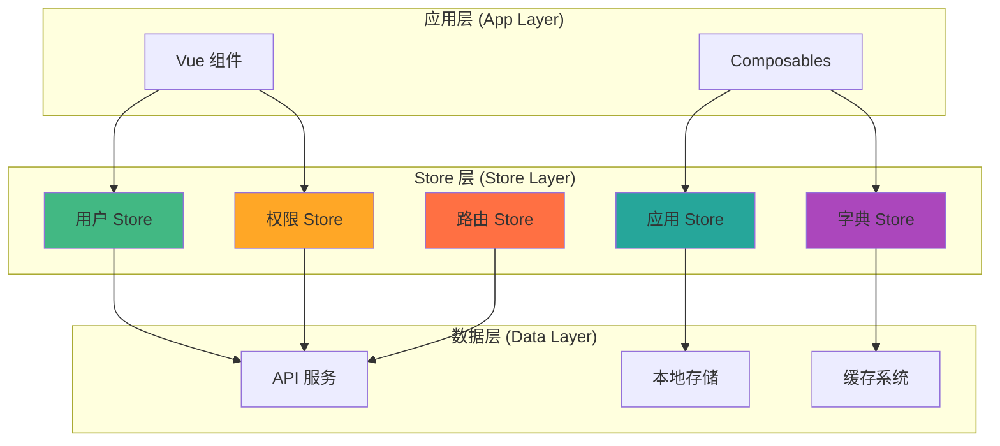

# 状态管理

HotGo 2.0 使用 Pinia 作为状态管理解决方案，提供了类型安全、模块化和可扩展的状态管理架构。

## Pinia 架构概览

### 为什么选择 Pinia

相比 Vuex，Pinia 具有以下优势：

- 🔷 **完整的 TypeScript 支持** - 无需复杂的类型定义
- 🏪 **模块化设计** - 每个 Store 都是独立的
- 🔧 **DevTools 支持** - 更好的调试体验
- 📦 **更小的包体积** - 树摇优化友好
- 🎯 **简化的 API** - 去除了 mutations 的概念

### Store 架构图



## Store 模块设计

### 1. 用户状态管理 (User Store)

```typescript
// stores/modules/user.ts
import { defineStore } from 'pinia';
import { ref, computed } from 'vue';
import type { UserInfo, LoginCredentials } from '@/types/user';
import { userApi, authApi } from '@/api';

export const useUserStore = defineStore('user', () => {
  // ========== 状态定义 ==========
  const userInfo = ref<UserInfo | null>(null);
  const token = ref<string>('');
  const refreshToken = ref<string>('');
  const roles = ref<string[]>([]);
  const permissions = ref<string[]>([]);
  
  // ========== 计算属性 ==========
  const isLoggedIn = computed(() => !!token.value && !!userInfo.value);
  
  const hasRole = computed(() => (role: string) => {
    return roles.value.includes(role);
  });
  
  const hasPermission = computed(() => (permission: string) => {
    return permissions.value.includes(permission);
  });
  
  const hasAnyPermission = computed(() => (permissions: string[]) => {
    return permissions.some(permission => hasPermission.value(permission));
  });
  
  const hasAllPermissions = computed(() => (permissions: string[]) => {
    return permissions.every(permission => hasPermission.value(permission));
  });
  
  const userProfile = computed(() => {
    if (!userInfo.value) return null;
    
    return {
      id: userInfo.value.id,
      username: userInfo.value.username,
      nickname: userInfo.value.nickname,
      avatar: userInfo.value.avatar,
      email: userInfo.value.email,
      roles: roles.value,
      permissions: permissions.value,
    };
  });
  
  // ========== 操作方法 ==========
  
  /**
   * 用户登录
   */
  const login = async (credentials: LoginCredentials) => {
    try {
      const response = await authApi.login(credentials);
      
      // 设置令牌
      token.value = response.token;
      refreshToken.value = response.refreshToken;
      
      // 获取用户信息
      await fetchUserInfo();
      
      // 持久化存储
      persistTokens();
      
      return response;
    } catch (error) {
      console.error('登录失败:', error);
      throw error;
    }
  };
  
  /**
   * 用户登出
   */
  const logout = async () => {
    try {
      // 调用登出 API
      if (token.value) {
        await authApi.logout();
      }
    } catch (error) {
      console.error('登出请求失败:', error);
    } finally {
      // 清理状态
      clearUserState();
    }
  };
  
  /**
   * 获取用户信息
   */
  const fetchUserInfo = async () => {
    if (!token.value) {
      throw new Error('No token available');
    }
    
    try {
      const response = await userApi.getUserInfo();
      
      userInfo.value = response.user;
      roles.value = response.roles;
      permissions.value = response.permissions;
      
      return response;
    } catch (error) {
      console.error('获取用户信息失败:', error);
      
      // 如果是认证错误，清理状态
      if (error.response?.status === 401) {
        clearUserState();
      }
      
      throw error;
    }
  };
  
  /**
   * 刷新令牌
   */
  const refreshAccessToken = async () => {
    if (!refreshToken.value) {
      throw new Error('No refresh token available');
    }
    
    try {
      const response = await authApi.refreshToken(refreshToken.value);
      
      token.value = response.token;
      refreshToken.value = response.refreshToken;
      
      persistTokens();
      
      return response;
    } catch (error) {
      console.error('刷新令牌失败:', error);
      clearUserState();
      throw error;
    }
  };
  
  /**
   * 更新用户信息
   */
  const updateUserInfo = async (updates: Partial<UserInfo>) => {
    if (!userInfo.value) {
      throw new Error('No user info available');
    }
    
    try {
      const response = await userApi.updateUserInfo(userInfo.value.id, updates);
      
      // 更新本地状态
      userInfo.value = { ...userInfo.value, ...response };
      
      return response;
    } catch (error) {
      console.error('更新用户信息失败:', error);
      throw error;
    }
  };
  
  /**
   * 修改密码
   */
  const changePassword = async (oldPassword: string, newPassword: string) => {
    if (!userInfo.value) {
      throw new Error('No user info available');
    }
    
    try {
      await userApi.changePassword({
        userId: userInfo.value.id,
        oldPassword,
        newPassword,
      });
      
      // 修改密码后需要重新登录
      await logout();
    } catch (error) {
      console.error('修改密码失败:', error);
      throw error;
    }
  };
  
  // ========== 辅助方法 ==========
  
  /**
   * 持久化令牌
   */
  const persistTokens = () => {
    if (token.value) {
      localStorage.setItem('access_token', token.value);
    }
    if (refreshToken.value) {
      localStorage.setItem('refresh_token', refreshToken.value);
    }
  };
  
  /**
   * 恢复令牌
   */
  const restoreTokens = () => {
    const accessToken = localStorage.getItem('access_token');
    const refreshTokenValue = localStorage.getItem('refresh_token');
    
    if (accessToken) {
      token.value = accessToken;
    }
    if (refreshTokenValue) {
      refreshToken.value = refreshTokenValue;
    }
  };
  
  /**
   * 清理用户状态
   */
  const clearUserState = () => {
    userInfo.value = null;
    token.value = '';
    refreshToken.value = '';
    roles.value = [];
    permissions.value = [];
    
    // 清理本地存储
    localStorage.removeItem('access_token');
    localStorage.removeItem('refresh_token');
  };
  
  /**
   * 初始化用户状态
   */
  const initializeAuth = async () => {
    // 恢复令牌
    restoreTokens();
    
    // 如果有令牌，尝试获取用户信息
    if (token.value) {
      try {
        await fetchUserInfo();
      } catch (error) {
        console.error('初始化认证失败:', error);
        clearUserState();
      }
    }
  };
  
  return {
    // 状态
    userInfo: readonly(userInfo),
    token: readonly(token),
    roles: readonly(roles),
    permissions: readonly(permissions),
    
    // 计算属性
    isLoggedIn,
    hasRole,
    hasPermission,
    hasAnyPermission,
    hasAllPermissions,
    userProfile,
    
    // 方法
    login,
    logout,
    fetchUserInfo,
    refreshAccessToken,
    updateUserInfo,
    changePassword,
    initializeAuth,
  };
});
```

### 2. 应用状态管理 (App Store)

```typescript
// stores/modules/app.ts
import { defineStore } from 'pinia';
import { ref, computed } from 'vue';
import type { ThemeMode, Language, AppConfig } from '@/types/app';

export const useAppStore = defineStore('app', () => {
  // ========== 状态定义 ==========
  const themeMode = ref<ThemeMode>('light');
  const language = ref<Language>('zh-CN');
  const sidebarCollapsed = ref(false);
  const loading = ref(false);
  const appConfig = ref<AppConfig>({
    title: 'HotGo 2.0',
    logo: '/logo.png',
    description: '现代化管理系统',
  });
  
  // 设备信息
  const isMobile = ref(false);
  const screenSize = ref<'xs' | 'sm' | 'md' | 'lg' | 'xl'>('lg');
  
  // 页面状态
  const pageLoading = ref(false);
  const pageTitle = ref('');
  const breadcrumbs = ref<BreadcrumbItem[]>([]);
  
  // ========== 计算属性 ==========
  const isDarkMode = computed(() => themeMode.value === 'dark');
  
  const isTablet = computed(() => ['sm', 'md'].includes(screenSize.value));
  
  const isDesktop = computed(() => ['lg', 'xl'].includes(screenSize.value));
  
  const sidebarWidth = computed(() => {
    if (isMobile.value) return 0;
    return sidebarCollapsed.value ? 64 : 240;
  });
  
  const appTitle = computed(() => {
    return pageTitle.value ? `${pageTitle.value} - ${appConfig.value.title}` : appConfig.value.title;
  });
  
  // ========== 操作方法 ==========
  
  /**
   * 切换主题模式
   */
  const toggleTheme = () => {
    themeMode.value = themeMode.value === 'light' ? 'dark' : 'light';
    persistTheme();
    applyTheme();
  };
  
  /**
   * 设置主题模式
   */
  const setTheme = (mode: ThemeMode) => {
    themeMode.value = mode;
    persistTheme();
    applyTheme();
  };
  
  /**
   * 设置语言
   */
  const setLanguage = (lang: Language) => {
    language.value = lang;
    localStorage.setItem('language', lang);
    
    // 更新 HTML lang 属性
    document.documentElement.lang = lang;
  };
  
  /**
   * 切换侧边栏
   */
  const toggleSidebar = () => {
    sidebarCollapsed.value = !sidebarCollapsed.value;
    localStorage.setItem('sidebarCollapsed', String(sidebarCollapsed.value));
  };
  
  /**
   * 设置侧边栏状态
   */
  const setSidebarCollapsed = (collapsed: boolean) => {
    sidebarCollapsed.value = collapsed;
    localStorage.setItem('sidebarCollapsed', String(collapsed));
  };
  
  /**
   * 设置加载状态
   */
  const setLoading = (loading: boolean) => {
    loading.value = loading;
  };
  
  /**
   * 设置页面加载状态
   */
  const setPageLoading = (loading: boolean) => {
    pageLoading.value = loading;
  };
  
  /**
   * 设置页面标题
   */
  const setPageTitle = (title: string) => {
    pageTitle.value = title;
    document.title = appTitle.value;
  };
  
  /**
   * 设置面包屑
   */
  const setBreadcrumbs = (items: BreadcrumbItem[]) => {
    breadcrumbs.value = items;
  };
  
  /**
   * 更新设备信息
   */
  const updateDeviceInfo = () => {
    const width = window.innerWidth;
    
    isMobile.value = width < 768;
    
    if (width < 576) {
      screenSize.value = 'xs';
    } else if (width < 768) {
      screenSize.value = 'sm';
    } else if (width < 992) {
      screenSize.value = 'md';
    } else if (width < 1200) {
      screenSize.value = 'lg';
    } else {
      screenSize.value = 'xl';
    }
    
    // 移动端自动收起侧边栏
    if (isMobile.value && !sidebarCollapsed.value) {
      setSidebarCollapsed(true);
    }
  };
  
  // ========== 辅助方法 ==========
  
  /**
   * 持久化主题设置
   */
  const persistTheme = () => {
    localStorage.setItem('themeMode', themeMode.value);
  };
  
  /**
   * 应用主题
   */
  const applyTheme = () => {
    const htmlElement = document.documentElement;
    
    if (themeMode.value === 'dark') {
      htmlElement.classList.add('dark');
    } else {
      htmlElement.classList.remove('dark');
    }
  };
  
  /**
   * 恢复应用设置
   */
  const restoreSettings = () => {
    // 恢复主题
    const savedTheme = localStorage.getItem('themeMode') as ThemeMode;
    if (savedTheme) {
      themeMode.value = savedTheme;
      applyTheme();
    }
    
    // 恢复语言
    const savedLanguage = localStorage.getItem('language') as Language;
    if (savedLanguage) {
      language.value = savedLanguage;
      document.documentElement.lang = savedLanguage;
    }
    
    // 恢复侧边栏状态
    const savedSidebarState = localStorage.getItem('sidebarCollapsed');
    if (savedSidebarState) {
      sidebarCollapsed.value = savedSidebarState === 'true';
    }
    
    // 更新设备信息
    updateDeviceInfo();
  };
  
  /**
   * 初始化应用
   */
  const initializeApp = () => {
    restoreSettings();
    
    // 监听窗口大小变化
    window.addEventListener('resize', updateDeviceInfo);
    
    // 监听主题变化
    const mediaQuery = window.matchMedia('(prefers-color-scheme: dark)');
    mediaQuery.addEventListener('change', (e) => {
      if (themeMode.value === 'system') {
        setTheme(e.matches ? 'dark' : 'light');
      }
    });
  };
  
  return {
    // 状态
    themeMode: readonly(themeMode),
    language: readonly(language),
    sidebarCollapsed: readonly(sidebarCollapsed),
    loading: readonly(loading),
    pageLoading: readonly(pageLoading),
    pageTitle: readonly(pageTitle),
    breadcrumbs: readonly(breadcrumbs),
    isMobile: readonly(isMobile),
    screenSize: readonly(screenSize),
    appConfig: readonly(appConfig),
    
    // 计算属性
    isDarkMode,
    isTablet,
    isDesktop,
    sidebarWidth,
    appTitle,
    
    // 方法
    toggleTheme,
    setTheme,
    setLanguage,
    toggleSidebar,
    setSidebarCollapsed,
    setLoading,
    setPageLoading,
    setPageTitle,
    setBreadcrumbs,
    updateDeviceInfo,
    initializeApp,
  };
});
```

### 3. 路由状态管理 (Route Store)

```typescript
// stores/modules/route.ts
import { defineStore } from 'pinia';
import { ref, computed } from 'vue';
import type { RouteRecordRaw } from 'vue-router';
import type { Menu } from '@/types/menu';
import { menuApi } from '@/api';

export const useRouteStore = defineStore('route', () => {
  // ========== 状态定义 ==========
  const routes = ref<RouteRecordRaw[]>([]);
  const menus = ref<Menu[]>([]);
  const permissions = ref<string[]>([]);
  const isRoutesGenerated = ref(false);
  
  // 标签页
  const tabs = ref<TabItem[]>([]);
  const activeTab = ref<string>('');
  
  // 缓存页面
  const cachedViews = ref<string[]>([]);
  
  // ========== 计算属性 ==========
  const flatRoutes = computed(() => {
    const flatten = (routes: RouteRecordRaw[]): RouteRecordRaw[] => {
      const result: RouteRecordRaw[] = [];
      
      routes.forEach(route => {
        result.push(route);
        if (route.children) {
          result.push(...flatten(route.children));
        }
      });
      
      return result;
    };
    
    return flatten(routes.value);
  });
  
  const menuTree = computed(() => {
    return buildMenuTree(menus.value);
  });
  
  const openTabs = computed(() => {
    return tabs.value.filter(tab => !tab.meta?.hideInTabs);
  });
  
  // ========== 操作方法 ==========
  
  /**
   * 生成动态路由
   */
  const generateRoutes = async (userPermissions: string[]) => {
    try {
      permissions.value = userPermissions;
      
      // 获取菜单数据
      const menuData = await menuApi.getMenus();
      menus.value = menuData;
      
      // 生成路由
      const generatedRoutes = generateRoutesFromMenus(menuData, userPermissions);
      routes.value = generatedRoutes;
      
      isRoutesGenerated.value = true;
      
      return generatedRoutes;
    } catch (error) {
      console.error('生成路由失败:', error);
      throw error;
    }
  };
  
  /**
   * 添加标签页
   */
  const addTab = (route: RouteLocationNormalized) => {
    if (route.meta?.hideInTabs) return;
    
    const existingTab = tabs.value.find(tab => tab.path === route.path);
    if (existingTab) {
      // 更新现有标签页
      Object.assign(existingTab, {
        name: route.name,
        title: route.meta?.title || route.name,
        meta: route.meta,
      });
    } else {
      // 添加新标签页
      tabs.value.push({
        path: route.path,
        name: route.name as string,
        title: route.meta?.title || route.name as string,
        meta: route.meta,
      });
    }
    
    activeTab.value = route.path;
  };
  
  /**
   * 关闭标签页
   */
  const closeTab = (path: string) => {
    const index = tabs.value.findIndex(tab => tab.path === path);
    if (index === -1) return;
    
    tabs.value.splice(index, 1);
    
    // 如果关闭的是当前标签页，切换到相邻标签页
    if (activeTab.value === path) {
      if (tabs.value.length > 0) {
        const newIndex = Math.min(index, tabs.value.length - 1);
        activeTab.value = tabs.value[newIndex].path;
      } else {
        activeTab.value = '';
      }
    }
  };
  
  /**
   * 关闭其他标签页
   */
  const closeOtherTabs = (path: string) => {
    tabs.value = tabs.value.filter(tab => 
      tab.path === path || tab.meta?.affix
    );
    activeTab.value = path;
  };
  
  /**
   * 关闭所有标签页
   */
  const closeAllTabs = () => {
    tabs.value = tabs.value.filter(tab => tab.meta?.affix);
    activeTab.value = tabs.value.length > 0 ? tabs.value[0].path : '';
  };
  
  /**
   * 添加缓存视图
   */
  const addCachedView = (name: string) => {
    if (!cachedViews.value.includes(name)) {
      cachedViews.value.push(name);
    }
  };
  
  /**
   * 移除缓存视图
   */
  const removeCachedView = (name: string) => {
    const index = cachedViews.value.indexOf(name);
    if (index > -1) {
      cachedViews.value.splice(index, 1);
    }
  };
  
  /**
   * 清空缓存视图
   */
  const clearCachedViews = () => {
    cachedViews.value = [];
  };
  
  // ========== 辅助方法 ==========
  
  /**
   * 从菜单生成路由
   */
  const generateRoutesFromMenus = (menus: Menu[], permissions: string[]): RouteRecordRaw[] => {
    const routes: RouteRecordRaw[] = [];
    
    menus.forEach(menu => {
      // 检查权限
      if (menu.permission && !permissions.includes(menu.permission)) {
        return;
      }
      
      const route: RouteRecordRaw = {
        path: menu.path,
        name: menu.name,
        component: menu.component ? () => import(`@/views/${menu.component}`) : undefined,
        meta: {
          title: menu.title,
          icon: menu.icon,
          permission: menu.permission,
          keepAlive: menu.keepAlive,
          hideInMenu: menu.hideInMenu,
          hideInTabs: menu.hideInTabs,
        },
      };
      
      // 处理子菜单
      if (menu.children && menu.children.length > 0) {
        route.children = generateRoutesFromMenus(menu.children, permissions);
      }
      
      routes.push(route);
    });
    
    return routes;
  };
  
  /**
   * 构建菜单树
   */
  const buildMenuTree = (menus: Menu[]): Menu[] => {
    const map = new Map<number, Menu>();
    const roots: Menu[] = [];
    
    // 建立映射
    menus.forEach(menu => {
      map.set(menu.id, { ...menu, children: [] });
    });
    
    // 构建树结构
    menus.forEach(menu => {
      const menuItem = map.get(menu.id)!;
      
      if (menu.parentId && map.has(menu.parentId)) {
        const parent = map.get(menu.parentId)!;
        parent.children = parent.children || [];
        parent.children.push(menuItem);
      } else {
        roots.push(menuItem);
      }
    });
    
    return roots;
  };
  
  return {
    // 状态
    routes: readonly(routes),
    menus: readonly(menus),
    permissions: readonly(permissions),
    isRoutesGenerated: readonly(isRoutesGenerated),
    tabs: readonly(tabs),
    activeTab: readonly(activeTab),
    cachedViews: readonly(cachedViews),
    
    // 计算属性
    flatRoutes,
    menuTree,
    openTabs,
    
    // 方法
    generateRoutes,
    addTab,
    closeTab,
    closeOtherTabs,
    closeAllTabs,
    addCachedView,
    removeCachedView,
    clearCachedViews,
  };
});
```

## Store 最佳实践

### 1. 状态规范化

```typescript
// ✅ 好的设计：扁平化状态结构
interface UserState {
  users: Record<string, User>;
  userIds: string[];
  loading: boolean;
  error: string | null;
}

// ❌ 不好的设计：嵌套过深的状态
interface BadUserState {
  data: {
    users: {
      list: User[];
      meta: {
        loading: boolean;
        error: string | null;
      };
    };
  };
}
```

### 2. 异步操作处理

```typescript
// 标准异步操作模式
export const useDataStore = defineStore('data', () => {
  const data = ref<any[]>([]);
  const loading = ref(false);
  const error = ref<string | null>(null);
  
  const fetchData = async () => {
    try {
      loading.value = true;
      error.value = null;
      
      const response = await api.getData();
      data.value = response.data;
      
      return response;
    } catch (err) {
      error.value = err.message;
      throw err;
    } finally {
      loading.value = false;
    }
  };
  
  return {
    data: readonly(data),
    loading: readonly(loading),
    error: readonly(error),
    fetchData,
  };
});
```

### 3. Store 组合

```typescript
// Store 之间的组合使用
export const usePermissionStore = defineStore('permission', () => {
  const userStore = useUserStore();
  const routeStore = useRouteStore();
  
  const checkPermission = (permission: string) => {
    return userStore.hasPermission(permission);
  };
  
  const filterMenusByPermission = (menus: Menu[]) => {
    return menus.filter(menu => {
      if (menu.permission) {
        return checkPermission(menu.permission);
      }
      return true;
    });
  };
  
  return {
    checkPermission,
    filterMenusByPermission,
  };
});
```

### 4. 持久化存储

```typescript
// 自动持久化插件
import { PiniaPluginContext } from 'pinia';

export function createPersistedState() {
  return (context: PiniaPluginContext) => {
    const { store, options } = context;
    
    // 只对标记了 persist 的 store 进行持久化
    if (!options.persist) return;
    
    const persistKey = `pinia-${store.$id}`;
    
    // 恢复状态
    const savedState = localStorage.getItem(persistKey);
    if (savedState) {
      store.$patch(JSON.parse(savedState));
    }
    
    // 监听状态变化并保存
    store.$subscribe((mutation, state) => {
      localStorage.setItem(persistKey, JSON.stringify(state));
    });
  };
}

// 使用示例
export const useUserStore = defineStore('user', () => {
  // store 实现
}, {
  persist: true, // 启用持久化
});
```

### 5. 类型安全

```typescript
// 强类型状态定义
interface AppState {
  theme: 'light' | 'dark' | 'system';
  language: 'zh-CN' | 'en-US';
  sidebar: {
    collapsed: boolean;
    width: number;
  };
}

export const useAppStore = defineStore('app', (): AppState & {
  // 方法类型定义
  setTheme: (theme: AppState['theme']) => void;
  toggleSidebar: () => void;
} => {
  const theme = ref<AppState['theme']>('light');
  const language = ref<AppState['language']>('zh-CN');
  const sidebar = reactive<AppState['sidebar']>({
    collapsed: false,
    width: 240,
  });
  
  const setTheme = (newTheme: AppState['theme']) => {
    theme.value = newTheme;
  };
  
  const toggleSidebar = () => {
    sidebar.collapsed = !sidebar.collapsed;
  };
  
  return {
    theme: readonly(theme),
    language: readonly(language),
    sidebar: readonly(sidebar),
    setTheme,
    toggleSidebar,
  };
});
```

## 性能优化

### 1. 状态订阅优化

```typescript
// 精确订阅状态变化
export function useUserWatcher() {
  const userStore = useUserStore();
  
  // 只监听特定属性
  watch(
    () => userStore.userInfo?.avatar,
    (newAvatar) => {
      // 头像变化处理
    }
  );
  
  // 使用 storeToRefs 保持响应性
  const { isLoggedIn, userProfile } = storeToRefs(userStore);
  
  return {
    isLoggedIn,
    userProfile,
  };
}
```

### 2. 计算属性缓存

```typescript
export const useDataStore = defineStore('data', () => {
  const items = ref<Item[]>([]);
  
  // 使用计算属性缓存复杂计算
  const expensiveComputed = computed(() => {
    return items.value
      .filter(item => item.active)
      .map(item => ({
        ...item,
        processed: heavyProcessing(item),
      }))
      .sort((a, b) => a.priority - b.priority);
  });
  
  return {
    items: readonly(items),
    expensiveComputed,
  };
});
```

---

下一步：[路由系统](./routing.md)


